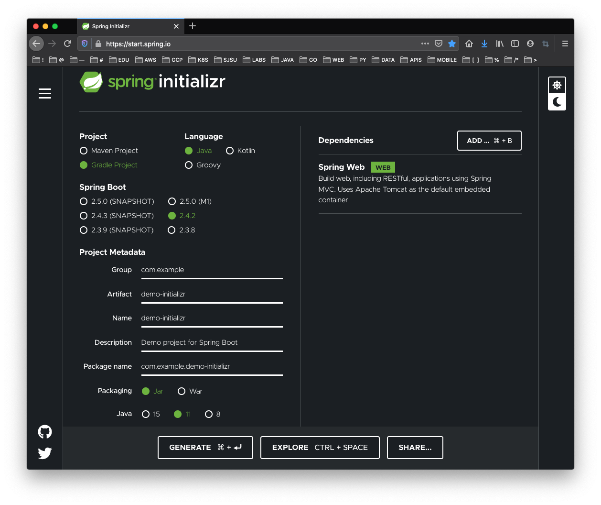

# CMPE 172 Lab #1 - Hello Spring

In this Lab, you will be bulling the Spring Demo App using different Spring Tools and deploying the Demos on Docker and Google Cloud.  Your work should be commited on a regular basis (each day you have a change) to your assigned GitHub Private Repo in the https://github.com/nguyensjsu organization.  You submission should include all the source code and notes on your work (including required screenshots) in README.md (GitHub Markdown).  

* In the /labs/lab1 folder, include
  * demo-initializr
  * demo-vscode
  * demo-docker
  * images (screenshots)
  * README.md (lab notes)

## Part 1 -- Spring Demo App

### Spring Demo App Using Spring Initializr

### Spring Demo App Using Spring Tools in Visual Studio Code

### Spring Demo App Configured for Docker and Kubernettes

## Part 2 -- Spring Taco Cloud App
