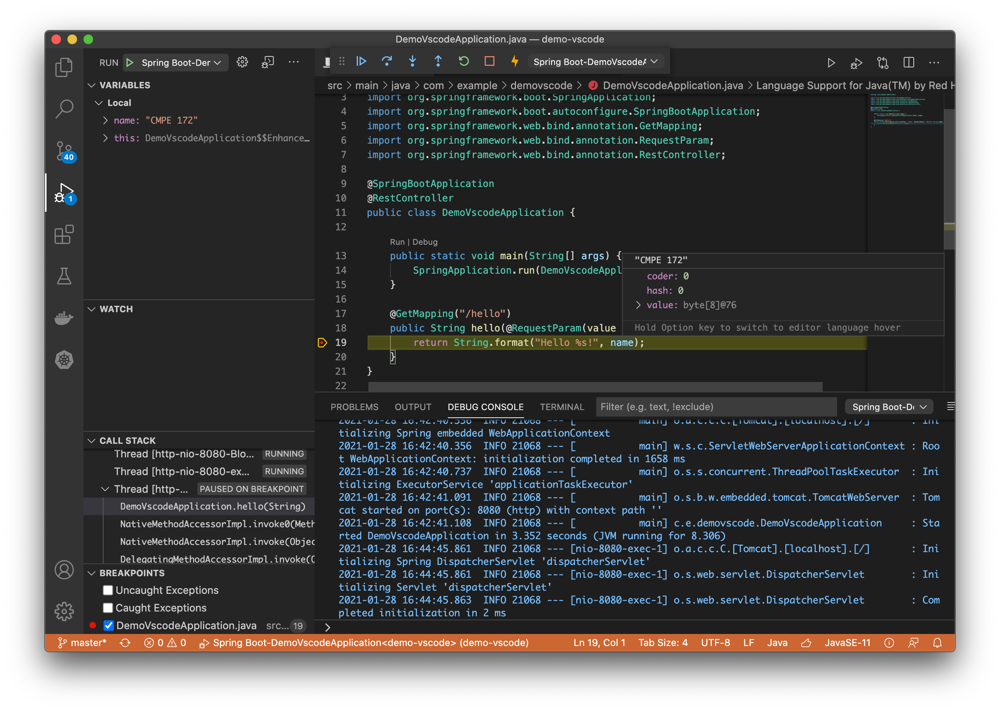
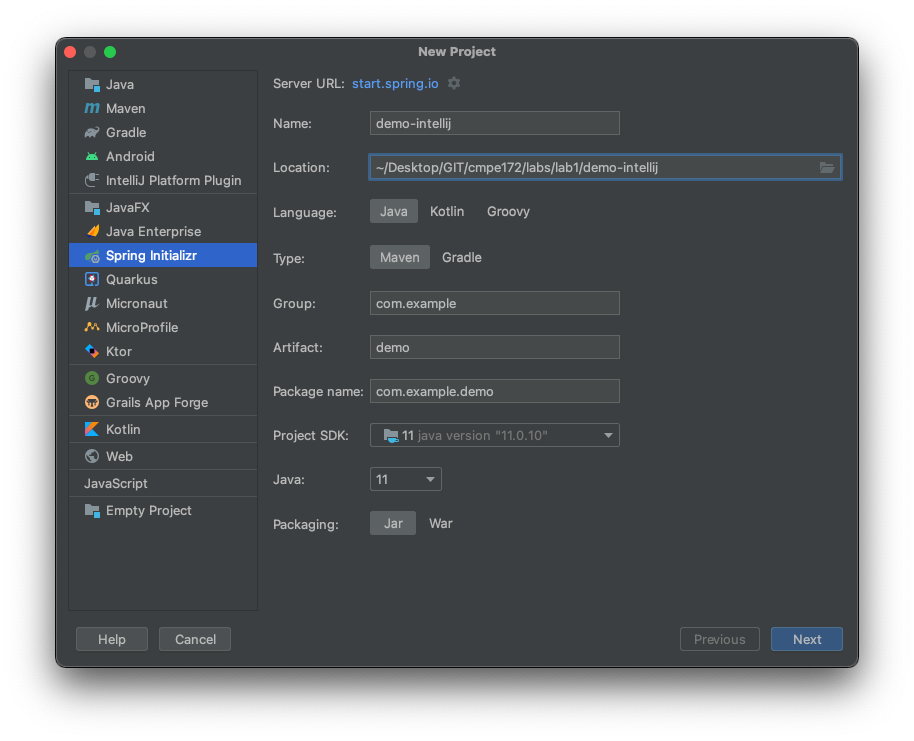
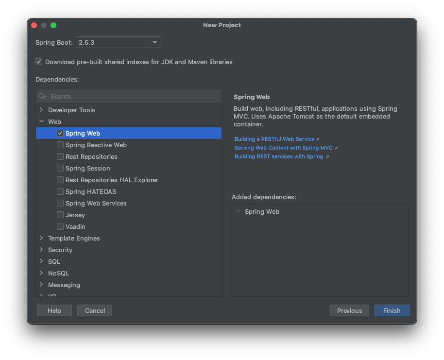
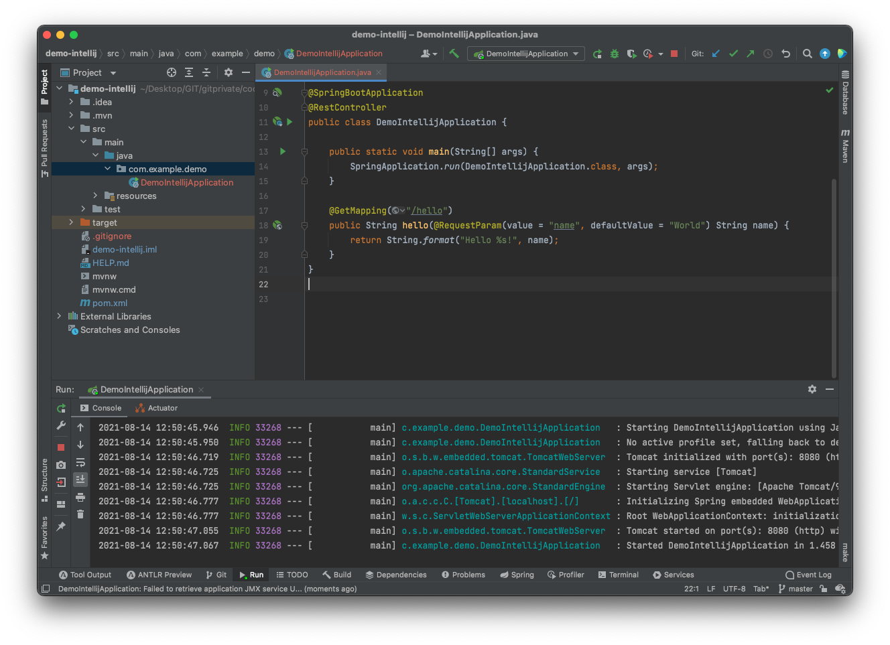

# CMPE 172 - Lab #1 - Hello Spring

In this Lab, you will be building the Spring Demo App using different Spring Tools and deploying the Demos on Docker and Google Cloud.  

Your work should be committed on a regular basis (each day you have a change) to your assigned GitHub Private Repo in the https://github.com/nguyensjsu organization.  Your submission should include all the source code and notes on your work (including required screenshots) in README.md (GitHub Markdown).  

* In the /labs/lab1 folder, include
  * demo-initializr
  * demo-vscode
  * demo-intellij
  * demo-docker
  * images (screenshots)
  * README.md (lab notes)


## Spring Demo App Using Spring Initializr

1. Generate a New Spring Boot Project using the following parameters via https://start.spring.io/ (online Spring Boot Initializr).

	* Project: Gradle Project
	* Language: Java Language (JDK 11)
	* Spring Boot Version: 2.4.2
	* Group: com.example
	* Artifact: demo-initializr
	* Name: demo-initializr
	* Package Name: come.example.demo-initializr
	* Packaging: Jar
	* Dependencies:
	  * Spring Web

	

2. Extract the Zip file and store in your Git Folder /labs/lab1/demo-initializr.  Make changes to the App using the following code. Note: you will need to modify the Class Name to match the code generated.
	
	```
	import org.springframework.boot.SpringApplication;
	import org.springframework.boot.autoconfigure.SpringBootApplication;
	import org.springframework.web.bind.annotation.GetMapping;
	import org.springframework.web.bind.annotation.RequestParam;
	import org.springframework.web.bind.annotation.RestController;
	
	@SpringBootApplication
	@RestController
	public class DemoXXXApplication {
	
		public static void main(String[] args) {
			SpringApplication.run(DemoXXXApplication.class, args);
		}
	
		@GetMapping("/hello")
		public String hello(@RequestParam(value = "name", defaultValue = "World") String name) {
			return String.format("Hello %s!", name);
		}
	}
	```

3. Run the Spring Demo App on your Local Machine with the message: *Hello CMPE 172!*.  Take a "Screenshot" of your Browser and Full Desktop and include this in your Lab Notes README.md in GitHub.


## Spring Demo App Using Spring Tools in Visual Studio Code

1. Generate a New Spring Boot Project using the following parameters from Visual Studio Code. Store in your Git Folder /labs/lab1/demo-vscode.

	* Project: Gradle Project
	* Language: Java Language (JDK 11)
	* Spring Boot Version: 2.4.2
	* Group: com.example
	* Artifact: demo-vscode
	* Name: demo-vscode
	* Package Name: come.example.demo-vscode
	* Packaging: Jar
	* Dependencies:
	  * Spring Web

2. Make the Appropriate Code Changes using the following:

	```
	import org.springframework.boot.SpringApplication;
	import org.springframework.boot.autoconfigure.SpringBootApplication;
	import org.springframework.web.bind.annotation.GetMapping;
	import org.springframework.web.bind.annotation.RequestParam;
	import org.springframework.web.bind.annotation.RestController;
	
	@SpringBootApplication
	@RestController
	public class DemoXXXApplication {
	
		public static void main(String[] args) {
			SpringApplication.run(DemoXXXApplication.class, args);
		}
	
		@GetMapping("/hello")
		public String hello(@RequestParam(value = "name", defaultValue = "World") String name) {
			return String.format("Hello %s!", name);
		}
	}
	```

3. Run the Spring Demo App from Visual Studio Code in "Debug Mode" with the message: *Hello CMPE 172!*.  Take a "Screenshot" of your Browser and Full Desktop and include this in your Lab Notes README.md in GitHub.

	


## Spring Demo App Configured for Docker and Kubernettes

1. Generate a New Spring Boot Project using the following parameters from Visual Studio Code or using Spring Boot Initializr. Store in your Git Folder /labs/lab1/demo-docker.

	* Project: Gradle Project
	* Language: Java Language (JDK 11)
	* Spring Boot Version: 2.4.2
	* Group: com.example
	* Artifact: demo-docker
	* Name: demo-vscode
	* Package Name: come.example.demo-docker
	* Packaging: Jar
	* Dependencies:
	  * Spring Web

2. Make the Appropriate Code Changes using the following:

	```
	import org.springframework.boot.SpringApplication;
	import org.springframework.boot.autoconfigure.SpringBootApplication;
	import org.springframework.web.bind.annotation.GetMapping;
	import org.springframework.web.bind.annotation.RequestParam;
	import org.springframework.web.bind.annotation.RestController;
	
	@SpringBootApplication
	@RestController
	public class DemoXXXApplication {
	
		public static void main(String[] args) {
			SpringApplication.run(DemoXXXApplication.class, args);
		}
	
		@GetMapping("/hello")
		public String hello(@RequestParam(value = "name", defaultValue = "World") String name) {
			return String.format("Hello %s!", name);
		}
	}
```

3. Using the Lab files provided, Do the following:

	- [ ] Build Docker Image
	- [ ] Run Docker Container in Docker Desktop (Locally)
	- [ ] Run Docker Container in Google Cloud Kubernetes Engine
	
	Files (add to demo-docker project):
	* Dockerfile 
	* Makefile
	* pod.yaml
	* service.yaml

Take "Screenshots" of your Browser and Full Desktop and include this in your Lab Notes README.md in GitHub.  Screenshots should include:  Spring Boot App running from Docker Desktop and Google Cloud.

Follow the instructions from Demos in class.


## Spring Demo App Using JetBrains Intellij IDEA


1. Generate a New Spring Boot Project using the following parameters from IntelliJ IDEA.  Store in your Git Folder /labs/lab1/demo-intellij.

	* Start a New Spring Initializr Project
	* Configure Project SDK (i.e. Select your JDK 11 install)
	* Spring Initializr Settings:
		1. Name: demo-intellij
		2. Group: com.example
		3. Location: <Your GIT Repo>/labs/lab1/demo-intellij
		4. Artifact: demo
		5. Type: Maven
		6. Language: Java
		7. Packaging: Jar
		8. Java Version: 11
		9. Version: 1.0
		10. Description: Demo project for Spring Boot
		11. Package: com.example.demo
	
		
		
	* Configure Sping Boot Options
		1. Spring Boot Version: latest (i.e. 2.5.3)
		2. Spring Dependencies:
			* Spring Web

		

2. Make the Appropriate Code Changes using the following:

	```
	import org.springframework.boot.SpringApplication;
	import org.springframework.boot.autoconfigure.SpringBootApplication;
	import org.springframework.web.bind.annotation.GetMapping;
	import org.springframework.web.bind.annotation.RequestParam;
	import org.springframework.web.bind.annotation.RestController;
	
	@SpringBootApplication
	@RestController
	public class DemoXXXApplication {
	
		public static void main(String[] args) {
			SpringApplication.run(DemoXXXApplication.class, args);
		}
	
		@GetMapping("/hello")
		public String hello(@RequestParam(value = "name", defaultValue = "World") String name) {
			return String.format("Hello %s!", name);
		}
	}
	```

	

3. Run the Spring Demo App on your Local Machine with the message: *Hello CMPE 172!*.  Take a "Screenshot" of your Browser and Full Desktop and include this in your Lab Notes README.md in GitHub.


* Commands:
	
	* mvn package
	* java -jar target/demo-1.0.jar

* URLS:

	* http://localhost:8080/hello
	* http://localhost:8080/hello?name=Amy


# Lab Notes 


## Java JDK and Gradle Setup

* https://sdkman.io/

* Install SDK Man and use SDK Man to install JDK and Gradle

* Commands:

SDK Command | Notes
----------- | ---------
sdk current | list current versions in use for JDK and Graddle
sdk list java |	list all versions available for java
sdk install java <version> | install a specific version of java
sdk list gradle | lists all versions available for gradle
sdk install gradle <version> | install a specific version of gradle
sdk list maven | lists all versions available for maven
sdk install maven <version> | install a specific version of maven


* Sample Setup:

```
pnguyen@macbook ~ % sdk current

Using:

gradle: 5.6
maven: 3.8.1
java: 11.0.10.j9-adpt

```

## Spring Initializr

* https://start.spring.io/

```
    Project: Gradle Project
    Language: Java Language (JDK 11)
    Spring Boot Version: 2.4.2
    Group: com.example
    Artifact: demo-initializr
    Name: demo-initializr
    Package Name: come.example.demo-initializr
    Packaging: Jar
    Dependencies:
        Spring Web
```


## Spring Quick Start Guide

* https://spring.io/quickstart

```
package com.example.demo;

import org.springframework.boot.SpringApplication;
import org.springframework.boot.autoconfigure.SpringBootApplication;
import org.springframework.web.bind.annotation.GetMapping;
import org.springframework.web.bind.annotation.RequestParam;
import org.springframework.web.bind.annotation.RestController;

@SpringBootApplication
@RestController
public class DemoApplication {

public static void main(String[] args) {
	SpringApplication.run(DemoApplication.class, args);
}

@GetMapping("/hello")
public String hello(@RequestParam(value = "name", defaultValue = "World") String name) {
	return String.format("Hello %s!", name);
}
}
```

* Commands:
	
	* gradle build
	* gradle bootRun

* URLS:

	* http://localhost:8080/hello
	* http://localhost:8080/hello?name=Amy


## Spring Boot with Visual Studio Code

* https://code.visualstudio.com/
* https://marketplace.visualstudio.com/items?itemName=Pivotal.vscode-boot-dev-pack
* https://marketplace.visualstudio.com/items?itemName=vscjava.vscode-spring-boot-dashboard

### How to Use

	* Open VS Code and press F1 or Ctrl + Shift + P to open command palette
	* Type "Spring" to find Spring Boot Tools


## Spring Boot with IntelliJ IDEA

* https://www.jetbrains.com/help/idea/getting-started.html
* https://www.jetbrains.com/help/idea/creating-and-running-your-first-java-application.html
* https://www.jetbrains.com/help/idea/running-applications.html
* https://www.jetbrains.com/help/idea/debugging-code.html
* https://www.jetbrains.com/help/idea/spring-boot.html

### How to Use

* Start a New Spring Initializr Project
* Configure Project SDK (i.e. Select your JDK 11 install)
* Spring Initializr Settings:
	1. Name: demo-intellij
	2. Group: com.example
	3. Location: <Your GIT Repo>/labs/lab1/demo-intellij
	4. Artifact: demo
	5. Type: Maven
	6. Language: Java
	7. Packaging: Jar
	8. Java Version: 11
	9. Version: 1.0
	10. Description: Demo project for Spring Boot
	11. Package: com.example.demo
	
* Configure Sping Boot Options
	1. Spring Boot Version: latest (i.e. 2.5.3)
	2. Spring Dependencies:
		* Spring Web

* Commands:
	
	* mvn package
	* java -jar target/demo-1.0.jar

* URLS:

	* http://localhost:8080/hello
	* http://localhost:8080/hello?name=Amy


## Docker & Kubernetes with Spring Boot


* Dockerfile (using OpenJDK 11)

```
FROM openjdk:11
EXPOSE 8080
ADD ./build/libs/demo-docker-1.0.jar /srv/demo-docker-1.0.jar
CMD java -jar /srv/demo-docker-1.0.jar
```

* Kubernetes Pod

```
apiVersion: v1
kind: Pod
metadata:
  name: spring-hello
  namespace: default
  labels:
    name: spring-hello
spec:
  containers:
    - image: paulnguyen/spring-hello:latest
      name: spring-hello
      ports:
        - containerPort: 8080
          name: http
          protocol: TCP
```

* Kubernetes Service

```
apiVersion: v1
kind: Service
metadata:
  name: spring-hello 
  namespace: default
spec:
  # comment or delete the following line if you want to use a LoadBalancer
  type: LoadBalancer
  # if your cluster supports it, uncomment the following to automatically create
  # an external load-balanced IP for the frontend service.
  # type: LoadBalancer
  ports:
  - port: 80
    targetPort: 8080 
  selector:
    name: spring-hello
```

* Makefile (Build and Deploy)

```
all: clean

clean:
	gradle clean

compile:
	gradle build

jar: compile
	gradle bootJar

run: jar
	echo Starting Spring at:  http://localhost:8080
	java -jar build/libs/demo-docker-1.0.jar

# Docker

docker-build: jar
	docker build -t spring-hello .
	docker images

docker-run: docker-build
	docker run --name spring-hello -td -p 80:8080 spring-hello	
	docker ps

docker-clean:
	docker stop spring-hello
	docker rm spring-hello
	docker rmi spring-hello

docker-shell:
	docker exec -it spring-hello bash 

docker-push:
	docker login
	docker build -t $(account)/spring-hello:latest -t $(account)/spring-hello:latest .
	docker push $(account)/spring-hello:latest 

# Pod

pod-run:
	kubectl apply -f pod.yaml

pod-list:
	kubectl get pods

pod-desc:
	kubectl describe pods spring-hello

pod-delete:
	kubectl delete -f pod.yaml

pod-shell:
	kubectl exec -it spring-hello -- /bin/bash

pod-logs:
	kubectl logs -f spring-hello

# Service

service-create:
	kubectl create -f service.yaml

service-get:
	kubectl get services

service-get-ip:
	kubectl get service spring-hello -o wide

service-delete:
	kubectl delete service spring-hello
```


# References

* https://spring.io/projects/spring-boot
* https://spring.io/guides
* https://github.com/spring-guides
* https://docs.spring.io/spring-boot/docs/ (archive)
* https://docs.spring.io/spring-boot/docs/current/reference/html/ (current)
* https://education.github.com/git-cheat-sheet-education.pdf (git cheatsheet)
* https://guides.github.com/pdfs/markdown-cheatsheet-online.pdf (markdown cheatsheet)
* https://kubernetes.io/docs/reference/kubectl/cheatsheet/ (kubernetes cheatsheet)
* https://docs.docker.com/engine/reference/commandline/cli/ (docker command line)
* https://kubernetes.io/docs/concepts/workloads/pods/ (kubernetes pods)
* https://kubernetes.io/docs/concepts/services-networking/service/ (kubernetes services)


