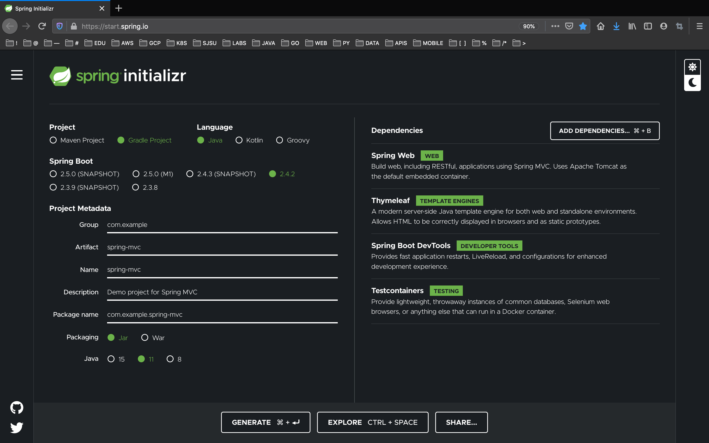
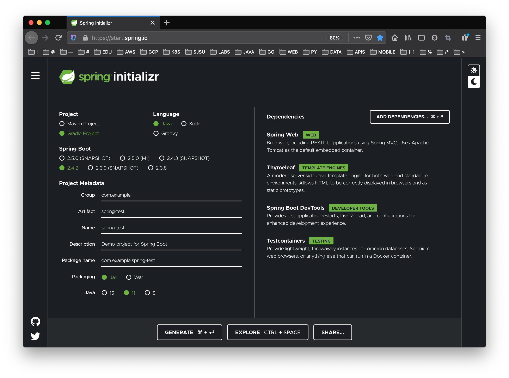
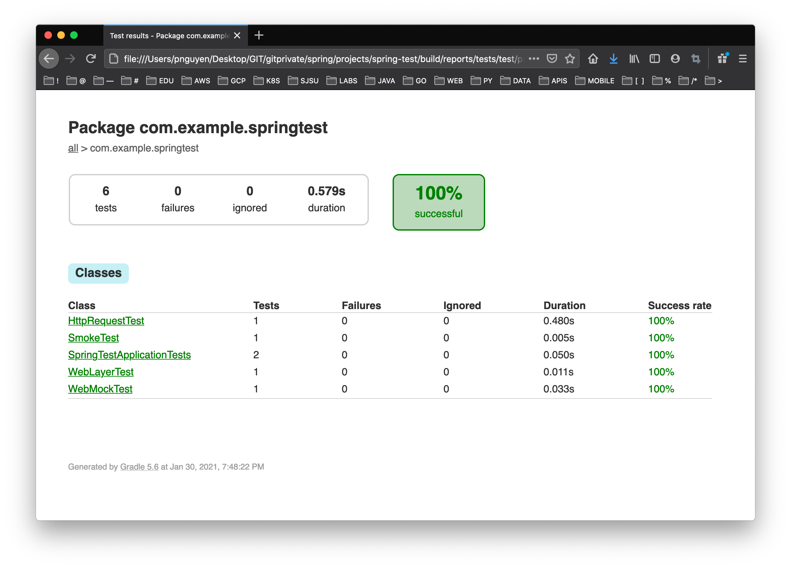

# CMPE 172 - Lab #2 - Spring MVC

In this Lab, you will be exploring Spring MVC and Spring Testing on Docker and Google Cloud.  Your work should be committed on a regular basis (each day you have a change) to your assigned GitHub Private Repo in the https://github.com/nguyensjsu organization.  Your submission should include all the source code and notes on your work (including required screenshots) in README.md (GitHub Markdown).  

* In the /labs/lab2 folder, include
  * spring-mvc
  * spring-test
  * spring-lombok
  * tacos-cloud
  * images (screenshots)
  * README.md (lab notes)

## Part 1 -- Spring MVC and Spring Testing

### Spring MVC Project - Serving Web Content with Spring MVC

* https://spring.io/guides/gs/serving-web-content
* https://github.com/spring-guides/gs-serving-web-content

1. Build and Deploy to GCP GKE the spring-mvc project based on https://spring.io/guides/gs/serving-web-content.  You may use the code sniplets below (modified from the Tutorial Page).

2. Gengerate a new Gradle project as follows:



3. Run the Spring App in Google Cloud and take a "Screenshot" of your Browser and Full Desktop and include this in your Lab Notes README.md in GitHub.


#### Greeting Controller

```
GreetingController.java:

import org.springframework.stereotype.Controller;
import org.springframework.ui.Model;
import org.springframework.web.bind.annotation.GetMapping;
import org.springframework.web.bind.annotation.RequestParam;

@Controller
public class GreetingController {

	@GetMapping("/greeting")
	public String greeting(@RequestParam(name="name", required=false, defaultValue="World") String name, Model model) {
		model.addAttribute("name", name);
		return "greeting";
	}

}

```

#### Greetings View Template (Thymeleaf)

```
<!DOCTYPE HTML>
<html xmlns:th="http://www.thymeleaf.org">
<head> 
    <title>Getting Started: Serving Web Content</title> 
    <meta http-equiv="Content-Type" content="text/html; charset=UTF-8" />
</head>
<body>
    <p th:text="'Hello, ' + ${name} + '!'" />
</body>
</html>
```


### Spring Test Project

* https://spring.io/guides/gs/testing-web
* https://github.com/spring-guides/gs-testing-web
* https://assertj.github.io/doc

1. Build and Deploy to GCP GKE the spring-test project based on https://spring.io/guides/gs/testing-web.  You may use the code sniplets below (modified from the Tutorial Page).

2. Gengerate a new Gradle project as follows:



3. Run the Spring App in Google Cloud and take a "Screenshot" of your Browser and Full Desktop and include this in your Lab Notes README.md in GitHub.

4. Run the Spring App Tests and take a "Screenshot" (Full Desktop) and include this in your Lab Notes README.md in GitHub the Test Results (See Example Below).




#### Home Controller.java

```
import org.springframework.stereotype.Controller;
import org.springframework.web.bind.annotation.RequestMapping;
import org.springframework.web.bind.annotation.ResponseBody;

@Controller
public class HomeController {

	@RequestMapping("/")
	public @ResponseBody String greeting() {
		return "Hello, World";
	}

}
```

#### SmokeTest.java

```
import static org.assertj.core.api.Assertions.assertThat;

import org.junit.jupiter.api.Test;

import org.springframework.beans.factory.annotation.Autowired;
import org.springframework.boot.test.context.SpringBootTest;

@SpringBootTest
public class SmokeTest {

	@Autowired
	private HomeController controller;

	@Test
	public void contextLoads() throws Exception {
		assertThat(controller).isNotNull();
	}
}
```

#### HTTPRequestTest.java

```
import org.junit.jupiter.api.Test;

import org.springframework.beans.factory.annotation.Autowired;
import org.springframework.boot.test.context.SpringBootTest;
import org.springframework.boot.test.context.SpringBootTest.WebEnvironment;
import org.springframework.boot.test.web.client.TestRestTemplate;
import org.springframework.boot.web.server.LocalServerPort;

import static org.assertj.core.api.Assertions.assertThat;

@SpringBootTest(webEnvironment = WebEnvironment.RANDOM_PORT)
public class HttpRequestTest {

	@LocalServerPort
	private int port;

	@Autowired
	private TestRestTemplate restTemplate;

	@Test
	public void greetingShouldReturnDefaultMessage() throws Exception {
		assertThat(this.restTemplate.getForObject("http://localhost:" + port + "/",
				String.class)).contains("Hello, World");
	}
}
```

#### TestingWebApplicationTest.java

```
import static org.hamcrest.Matchers.containsString;
import static org.springframework.test.web.servlet.request.MockMvcRequestBuilders.get;
import static org.springframework.test.web.servlet.result.MockMvcResultHandlers.print;
import static org.springframework.test.web.servlet.result.MockMvcResultMatchers.content;
import static org.springframework.test.web.servlet.result.MockMvcResultMatchers.status;

import org.junit.jupiter.api.Test;

import org.springframework.beans.factory.annotation.Autowired;
import org.springframework.boot.test.autoconfigure.web.servlet.AutoConfigureMockMvc;
import org.springframework.boot.test.context.SpringBootTest;
import org.springframework.test.web.servlet.MockMvc;

@SpringBootTest
@AutoConfigureMockMvc
public class TestingWebApplicationTest {

	@Autowired
	private MockMvc mockMvc;

	@Test
	public void shouldReturnDefaultMessage() throws Exception {
		this.mockMvc.perform(get("/")).andDo(print()).andExpect(status().isOk())
				.andExpect(content().string(containsString("Hello, World")));
	}
}
```

#### WebLayerTest.java

```
import static org.hamcrest.Matchers.containsString;
import static org.springframework.test.web.servlet.request.MockMvcRequestBuilders.get;
import static org.springframework.test.web.servlet.result.MockMvcResultHandlers.print;
import static org.springframework.test.web.servlet.result.MockMvcResultMatchers.content;
import static org.springframework.test.web.servlet.result.MockMvcResultMatchers.status;

import org.junit.jupiter.api.Test;

import org.springframework.beans.factory.annotation.Autowired;
import org.springframework.boot.test.autoconfigure.web.servlet.WebMvcTest;
import org.springframework.test.web.servlet.MockMvc;

@WebMvcTest(HomeController.class)
//tag::test[]
public class WebLayerTest {

	@Autowired
	private MockMvc mockMvc;

	@Test
	public void shouldReturnDefaultMessage() throws Exception {
		this.mockMvc.perform(get("/")).andDo(print()).andExpect(status().isOk())
				.andExpect(content().string(containsString("Hello, World")));
	}
}
```

#### GreetingController.java

```
import org.springframework.stereotype.Controller;
import org.springframework.web.bind.annotation.RequestMapping;
import org.springframework.web.bind.annotation.ResponseBody;


@Controller
public class GreetingController {

	private final GreetingService service;

	public GreetingController(GreetingService service) {
		this.service = service;
	}

	@RequestMapping("/greeting")
	public @ResponseBody String greeting() {
		return service.greet();
	}

}
```

#### GreetingService.java

```
import org.springframework.stereotype.Service;

@Service
public class GreetingService {
	public String greet() {
		return "Hello, World";
	}
}
```

#### WebMockTest.java

```
import static org.hamcrest.Matchers.containsString;
import static org.mockito.Mockito.when;
import static org.springframework.test.web.servlet.request.MockMvcRequestBuilders.get;
import static org.springframework.test.web.servlet.result.MockMvcResultHandlers.print;
import static org.springframework.test.web.servlet.result.MockMvcResultMatchers.content;
import static org.springframework.test.web.servlet.result.MockMvcResultMatchers.status;

import org.junit.jupiter.api.Test;

import org.springframework.beans.factory.annotation.Autowired;
import org.springframework.boot.test.autoconfigure.web.servlet.WebMvcTest;
import org.springframework.boot.test.mock.mockito.MockBean;
import org.springframework.test.web.servlet.MockMvc;

@WebMvcTest(GreetingController.class)
public class WebMockTest {

	@Autowired
	private MockMvc mockMvc;

	@MockBean
	private GreetingService service;

	@Test
	public void greetingShouldReturnMessageFromService() throws Exception {
		when(service.greet()).thenReturn("Hello, Mock");
		this.mockMvc.perform(get("/greeting")).andDo(print()).andExpect(status().isOk())
				.andExpect(content().string(containsString("Hello, Mock")));
	}
}
```

### Spring Lombok

* https://springframework.guru/spring-boot-with-lombok-part-1/


1. Build and Deploy to GCP GKE the spring-lombok project based on https://springframework.guru/spring-boot-with-lombok-part-1/.  You may use the code sniplets below (taken also from the Tutorial Page).

2. Gengerate a new project as follows:


3. Run the Spring App locally and take "Screenshots" of test output (Full Desktop) and include this in your Lab Notes README.md in GitHub.  Have Screenshots for each of the tests below along with a discussion in your README.md for the Lab on:  a) The Lombok Annonation or Feature being tested and b) How does the Output verify your understanding of the Feature being tested?

* ValAndVarUserDemo.print() ;
* FieldLevelGetterSetterDemo.print() ;
* GetterSetterUserDemo.print() ;
* ConstructorUserDemo.print() ;
* DataUserDemo.print() ;
* NonNullUserDemo.print() ;


### SpringLombokApplication.java

```
package com.example.springlombok;

import org.springframework.boot.SpringApplication;
import org.springframework.boot.autoconfigure.SpringBootApplication;
import org.springframework.web.bind.annotation.GetMapping;
import org.springframework.web.bind.annotation.RequestParam;
import org.springframework.web.bind.annotation.RestController;

@SpringBootApplication
@RestController
public class SpringLombokApplication {

	public static void main(String[] args) {
		SpringApplication.run(SpringLombokApplication.class, args);
	}

	@GetMapping("/hello")
	public String hello(@RequestParam(value = "name", defaultValue = "World") String name) {

		ValAndVarUserDemo.print() ;
		FieldLevelGetterSetterDemo.print() ;
		GetterSetterUserDemo.print() ;
		ConstructorUserDemo.print() ;
		DataUserDemo.print() ;
		NonNullUserDemo.print() ;

		return String.format("Hello %s!", name);
	}

}
```

### ValAndVarUserDemo.java

```
package com.example.springlombok;

import java.math.BigDecimal;
import java.util.ArrayList;
import lombok.val;

public class ValAndVarUserDemo {

    public String valCheck() {
      /*
      val makes local final variable (inside method)
      Trying to assign a value will result in
      Error: java: cannot assign a value to final variable userName
      */
      val userName = "Hello World";
      System.out.println(userName.getClass());
      return userName.toLowerCase();
    }
  
    public Object varCheck() {
      /*
      var makes local variable (inside method).
      Same as var but is not marked final
      */
      var money = new BigDecimal(53.00);
      System.out.println(money.getClass());
      money = new BigDecimal(80.00);
      return money;
    }

    public static void print()
	{
        System.out.println( "\n\n*** ValAndVarUserDemo ***\n") ;
        ValAndVarUserDemo obj = new ValAndVarUserDemo() ;
        System.out.println( "valCheck = " + obj.valCheck() ) ;   
        System.out.println( "varCheck = " + obj.varCheck() ) ;   
	}

  }
  ```


### FieldLevelGetterSetterDemo.java

```
package com.example.springlombok;

import java.lang.reflect.* ;
import lombok.Getter;
import lombok.Setter;

public class FieldLevelGetterSetterDemo {

    private int userId;

    @Getter @Setter
    private String userName;

    @Getter
    private int userAge;
    
    public FieldLevelGetterSetterDemo(int userAge){
      this.userAge=userAge;
    }

    public static void print()
	{
		System.out.println( "\n\n***** FieldLevelGetterSetterDemo Bytecode Dump *****" ) ;
		FieldLevelGetterSetterDemo m = new FieldLevelGetterSetterDemo(10) ;
		Class gmClass = m.getClass() ;

        System.out.println( "\nFIELDS:" ) ;
        Field[] fields = gmClass.getDeclaredFields();
        for (Field f : fields) {

        	int mods = f.getModifiers();
 
        	if ( Modifier.isPublic(mods) )
        		System.out.format( "  public" ) ;
        	else if ( Modifier.isPrivate(mods) )
        		System.out.format( "  private" ) ;
        	else if ( Modifier.isProtected(mods) )
        		System.out.format( "  protected" ) ;
 
        	if ( Modifier.isStatic(mods) )
        		System.out.format( " static") ;

        	System.out.format( " %s %s\n", f.getType(), f.getName() ) ;

        }

        System.out.println( "\nMETHODS:" ) ;
        Method gmMethods[] = gmClass.getMethods() ;
        for ( int i=0; i <gmMethods.length; i++ )
        {
            Method theMethod = gmMethods[i] ;
            String method = theMethod.toString() ;
            System.out.format( "  %s\n", method ) ;
        }
		
	}  

}
```

### GetterSetterUserDemo.java

```
package com.example.springlombok;

import java.lang.reflect.* ;
import lombok.*;

/*
@Getter and @Setter annotations for getter and setter methods
*/
@Getter
@Setter
public class GetterSetterUserDemo {

  private int userId;
  private String userName;
  private int userAge;

  public static void print()
  {
      System.out.println( "\n\n***** GetterSetterUserDemo Bytecode Dump *****" ) ;
      GetterSetterUserDemo m = new GetterSetterUserDemo() ;
      Class gmClass = m.getClass() ;

      System.out.println( "\nFIELDS:" ) ;
      Field[] fields = gmClass.getDeclaredFields();
      for (Field f : fields) {

          int mods = f.getModifiers();

          if ( Modifier.isPublic(mods) )
              System.out.format( "  public" ) ;
          else if ( Modifier.isPrivate(mods) )
              System.out.format( "  private" ) ;
          else if ( Modifier.isProtected(mods) )
              System.out.format( "  protected" ) ;

          if ( Modifier.isStatic(mods) )
              System.out.format( " static") ;

          System.out.format( " %s %s\n", f.getType(), f.getName() ) ;

      }

      System.out.println( "\nMETHODS:" ) ;
      Method gmMethods[] = gmClass.getMethods() ;
      for ( int i=0; i <gmMethods.length; i++ )
      {
          Method theMethod = gmMethods[i] ;
          String method = theMethod.toString() ;
          System.out.format( "  %s\n", method ) ;
      }
      
  }  

}
```

### ConstructorUserDemo.java

```
package com.example.springlombok;

import java.lang.reflect.* ;
import lombok.*;

/*
@NoArgsConstructor annotation for generating a constructor with no parameters
*/
@NoArgsConstructor
/*
@AllArgsConstructor annotation for generating a constructor
with 1 parameter for each field
*/
@AllArgsConstructor
public class ConstructorUserDemo {
  private int userId;
  private String userName;
  private int userAge;

  public static void print()
  {
      System.out.println( "\n\n***** ConstructorUserDemo Bytecode Dump *****" ) ;
      ConstructorUserDemo m = new ConstructorUserDemo() ;
      Class gmClass = m.getClass() ;

      System.out.println( "\nFIELDS:" ) ;
      Field[] fields = gmClass.getDeclaredFields();
      for (Field f : fields) {

          int mods = f.getModifiers();

          if ( Modifier.isPublic(mods) )
              System.out.format( "  public" ) ;
          else if ( Modifier.isPrivate(mods) )
              System.out.format( "  private" ) ;
          else if ( Modifier.isProtected(mods) )
              System.out.format( "  protected" ) ;

          if ( Modifier.isStatic(mods) )
              System.out.format( " static") ;

          System.out.format( " %s %s\n", f.getType(), f.getName() ) ;

      }

      System.out.println( "\nMETHODS:" ) ;
      Method gmMethods[] = gmClass.getMethods() ;
      for ( int i=0; i <gmMethods.length; i++ )
      {
          Method theMethod = gmMethods[i] ;
          String method = theMethod.toString() ;
          System.out.format( "  %s\n", method ) ;
      }
      
  }  

}
```

### DataUserDemo.java

```
package com.example.springlombok;

import java.lang.reflect.* ;
import lombok.Builder;
import lombok.Data;

@Data
public class DataUserDemo {
  
  private int userId;
  private String userName;
  private int userAge;

  public static void print()
  {
      System.out.println( "\n\n***** DataUserDemo Bytecode Dump *****" ) ;
      DataUserDemo m = new DataUserDemo() ;
      Class gmClass = m.getClass() ;

      System.out.println( "\nFIELDS:" ) ;
      Field[] fields = gmClass.getDeclaredFields();
      for (Field f : fields) {

          int mods = f.getModifiers();

          if ( Modifier.isPublic(mods) )
              System.out.format( "  public" ) ;
          else if ( Modifier.isPrivate(mods) )
              System.out.format( "  private" ) ;
          else if ( Modifier.isProtected(mods) )
              System.out.format( "  protected" ) ;

          if ( Modifier.isStatic(mods) )
              System.out.format( " static") ;

          System.out.format( " %s %s\n", f.getType(), f.getName() ) ;

      }

      System.out.println( "\nMETHODS:" ) ;
      Method gmMethods[] = gmClass.getMethods() ;
      for ( int i=0; i <gmMethods.length; i++ )
      {
          Method theMethod = gmMethods[i] ;
          String method = theMethod.toString() ;
          System.out.format( "  %s\n", method ) ;
      }
      
  }  

}
```

### NonNullUserDemo.java

```
package com.example.springlombok;

import lombok.NonNull;

public class NonNullUserDemo {
  private int userId;
  private String userName;
  private int userAge;

  public NonNullUserDemo(int userId, @NonNull String userName, int userAge) {
    if (userName == null) {
      throw new NullPointerException("userName is marked non-null but is null");
    } else {
      this.userId = userId;
      this.userName = userName;
      this.userAge = userAge;
    }
  }

  public static void print()
  {
    System.out.println( "\n\n***** NonNullUserDemo *****" ) ;

    try {
        NonNullUserDemo val = new NonNullUserDemo(50, null, 25);
    } catch ( Exception e ) {
        System.out.println( e ) ;
    }
   
  }

}
```


## Part 2 -- Tacos Cloud App (Version 2)

Using the Sample code from Chapter 2 of *Spring in Action 5th Edition*, copy your Tacos Spring Boot project from Lag #1 into /labs/lab2/tacos-cloud, make the nessary changes from the Book and deploy the Application on go Google Cloud Kubernetes Engine.  Please note that you make skip porting over the Tests from Chapter 2.

Take Screenshots showing:  

1. The Tacos Cloud Pod Workload
2. The Tacos Cloud Service (show Public IP and Port)
3. Browser Showing Tacos Cloud App Running


# Lab Notes and References

* https://spring.io/projects/spring-boot
* https://spring.io/guides
* https://github.com/spring-guides
* https://spring.io/guides/gs/serving-web-content/
* https://spring.io/guides/gs/testing-web/


