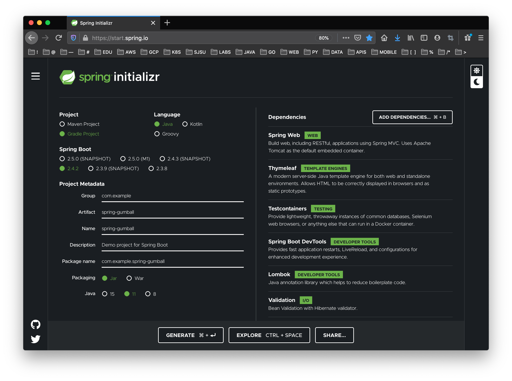

# CMPE 172 - Lab #3 - Spring Gumball (Version 1)

In this Lab, you will be buidling a Spring Gumball App, Testing it with Test Containers and Exploring Deployment on Docker and Google Cloud (GKE) with Load Balancers.  Your work should be committed on a regular basis (each day you have a change) to your assigned GitHub Private Repo in the https://github.com/nguyensjsu organization.  Your submission should include all the source code and notes on your work (including required screenshots) in README.md (GitHub Markdown).  

* In the /labs/lab3 folder, include
  * spring-gumball  (note: use starter code here:  https://github.com/paulnguyen/cmpe172/tree/main/spring/spring-gumball-v1)
  * images (screenshots)
  * README.md (lab notes)
  
## Part 1 -- Spring Gumball on Docker 

* Project Dependencies - Note that the proect was initialized with Spring Boot as follows:



* Java State Machine for Gumball Business Logic - The starter code includes a State Machine (Java Pattern) with a JUnit Test.  The State Machine Design is as follows and the code is in the "com.example.gumballmachine" package.


* Gumball Spring MVC Code

1. GumballModel.java

This code is currently a "place holder" in version 1 of this example.  It does not do much, but will play in important role in future versions.

```
package com.example.springgumball;

import lombok.Data;
import lombok.RequiredArgsConstructor;

@Data
@RequiredArgsConstructor
class GumballModel {

    private String modelNumber ;
    private String serialNumber ;
    private Integer countGumballs ;
    
}
```

2. GumballCommand.java

The Command Model is used to capture the actions and inputs from POST request from HTML forms in the View.  It is using Lombok Framework to generate all the required Java Beans Methods.

```
package com.example.springgumball;

import lombok.Data;
import lombok.RequiredArgsConstructor;

@Data
@RequiredArgsConstructor
class GumballCommand {

    private String action ;
    private String message ;
    
}
```

3. GumballMachineController.java

The Gumball Machine Controller handles the GET and POST actions from HTTP, creates and manages business logic via HTTP Sessions and the Gumball Machine State Object.

```
package com.example.springgumball;

import javax.validation.Valid;
import javax.servlet.http.HttpServletRequest;
import javax.servlet.http.HttpSession;
import java.net.InetAddress;

import org.springframework.stereotype.Controller;
import org.springframework.ui.Model;
import org.springframework.validation.Errors;
import org.springframework.web.bind.annotation.GetMapping;
import org.springframework.web.bind.annotation.ModelAttribute;
import org.springframework.web.bind.annotation.PostMapping;
import org.springframework.web.bind.annotation.RequestMapping;
import org.springframework.web.bind.annotation.RequestParam;

import lombok.extern.slf4j.Slf4j;

import com.example.gumballmachine.GumballMachine ;

@Slf4j
@Controller
@RequestMapping("/")
public class GumballMachineController {

    @GetMapping
    public String getAction( @ModelAttribute("command") GumballCommand command, 
                            Model model, HttpSession session) {
      
        GumballModel g = new GumballModel() ;
        g.setModelNumber( "SB102927") ;
        g.setSerialNumber( "2134998871109") ;
        model.addAttribute( "gumball", g ) ;
        
        GumballMachine gm = new GumballMachine(10) ;
        String message = gm.toString() ;
        session.setAttribute( "gumball", gm) ;
        String session_id = session.getId() ;

        String server_ip = "" ;
        String host_name = "" ;
        try { 
            InetAddress ip = InetAddress.getLocalHost() ;
            server_ip = ip.getHostAddress() ;
            host_name = ip.getHostName() ;
  
        } catch (Exception e) { }
  
        model.addAttribute( "session", session_id ) ;
        model.addAttribute( "message", message ) ;
        model.addAttribute( "server",  host_name + "/" + server_ip ) ;

        return "gumball" ;

    }

    @PostMapping
    public String postAction(@Valid @ModelAttribute("command") GumballCommand command,  
                            @RequestParam(value="action", required=true) String action,
                            Errors errors, Model model, HttpServletRequest request) {
    
        log.info( "Action: " + action ) ;
        log.info( "Command: " + command ) ;
    
        HttpSession session = request.getSession() ;
        GumballMachine gm = (GumballMachine) session.getAttribute("gumball") ;

        if ( action.equals("Insert Quarter") ) {
            gm.insertQuarter() ;
        }

        if ( action.equals("Turn Crank") ) {
            command.setMessage("") ;
            gm.turnCrank() ;
        } 

        session.setAttribute( "gumball", gm) ;
        String message = gm.toString() ;
        String session_id = session.getId() ;        

        String server_ip = "" ;
        String host_name = "" ;
        try { 
            InetAddress ip = InetAddress.getLocalHost() ;
            server_ip = ip.getHostAddress() ;
            host_name = ip.getHostName() ;
  
        } catch (Exception e) { }
  
        model.addAttribute( "session", session_id ) ;
        model.addAttribute( "message", message ) ;
        model.addAttribute( "server",  host_name + "/" + server_ip ) ;
     

        if (errors.hasErrors()) {
            return "gumball";
        }

        return "gumball";
    }

}
```

4. Gumball HTML View Page

```
<!DOCTYPE html>
<html xmlns="http://www.w3.org/1999/xhtml" 
      xmlns:th="http://www.thymeleaf.org">

<html>
<head>
    <title>Welcome to the Gumball Machine</title>
    <link rel="stylesheet" th:href="@{/styles.css}" />
</head>

<body>
<h1 align="center">Welcome to the Gumball Machine</h1>

<!-- FORM SECTION -->
<form name="form" th:object="${command}" method="post" action="">
    <p>
    <table id="msg" align="center" style="width:40%">
      <tr>
        <td>
          <pre id="pre">
          <span th:text="${message}" />
          </pre>
        </td>
      </tr>
    </table>
    </p>
    <p align="center"> </p>
    <br/>
    <p align="center">
        Special Instructions:  <input type="text" id="message" th:field="*{message}"/>
        <br/>
        <br/>
        <br/>
        <input type="submit" name="action" id="btnInsertQuarter" value="Insert Quarter">
        &nbsp;&nbsp;&nbsp;&nbsp;
        <input type="submit" name="action" id="btnTurnCrank" value="Turn Crank">
    </p>
</form>
<!-- END FORM SECTION -->

<br/>
<br/>
<br/>
<br/>
<br/>
<br/>

<table align="center" style="width:100%" >
<tr>
  <td style="text-align: left;" >
    <pre>Session ID:  <span th:text="${session}" /></pre>
  </td>
  <td style="text-align: right;" >
    <pre>Server Host/IP:  <span th:text="${server}" /></pre>
  </td>  
</tr>
</table>

</body>
</html>
```

5. docker-compose.yaml

The Docker Compose Spec is used to deployed a load balanced local spring gumball environment on docker.  Rules in the Makefile can be used to managed this.  Specifically, this commands brings up a load balancer and two insstances of spring gumball spring boot app:  

* docker-compose up --scale gumball=2 -d

```
version: "3"

services:
  gumball:
    image: spring-gumball
    volumes:
      - /tmp:/tmp
    networks:
      - network   
    ports:
      - 8080    
    restart: always     
  lb:
    image: eeacms/haproxy
    depends_on:
    - gumball
    ports:
    - "80:5000"
    - "1936:1936"
    environment:
      BACKENDS: "gumball"
      BACKENDS_PORT: "8080"
      DNS_ENABLED: "true"
      COOKIES_ENABLED: "false"
      LOG_LEVEL: "info"
    networks:
      - network

volumes:
  schemas:
    external: false

networks:
  network:
    driver: bridge
``


## Part 2 -- Spring Gumball on Google Cloud 


# Lab Notes and References

* https://docs.spring.io/spring-boot/docs/current/reference/html
* https://www.selenium.dev/documentation/en/webdriver/browser_manipulation
* https://junit.org/junit5/docs/current/user-guide/#writing-tests
* https://www.testcontainers.org/modules/webdriver_containers
* https://github.com/testcontainers/testcontainers-java/tree/master/examples
* https://www.javadoc.io/doc/org.seleniumhq.selenium/selenium-api/3.141.59/overview-summary.html


