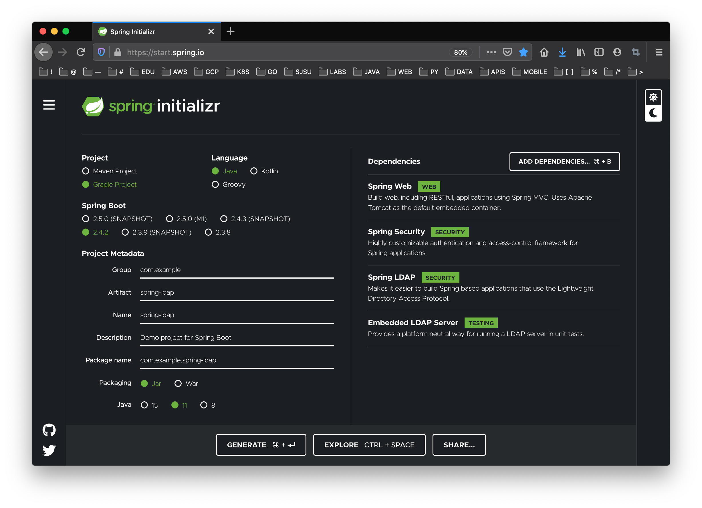
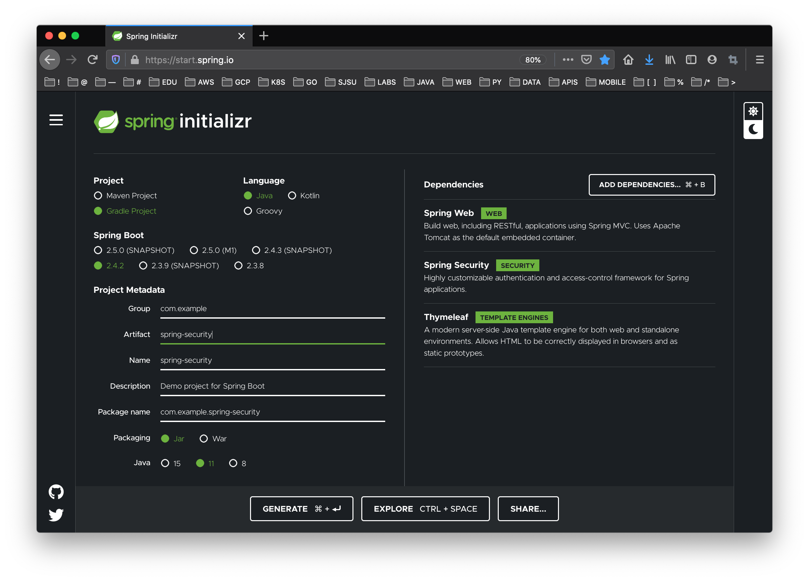
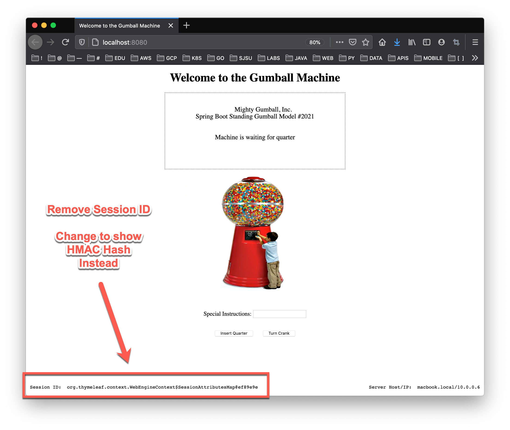

# CMPE 172 - Lab #4 - Spring Security & Spring Gumball (Version 2)

* Lab Files with Starter Code: https://github.com/paulnguyen/cmpe172/tree/main/labs/lab4

In this Lab, you will be exploring Spring Security and Testing them locally on your machine.  In addition, you will be making changes to Spring Gumballl (Version 2) and deploying it to Google Cloud (GKE).  Your work should be committed on a regular basis (each day you have a change) to your assigned GitHub Private Repo in the https://github.com/nguyensjsu organization.  Your submission should include all the source code and notes on your work (including required screenshots) in README.md (GitHub Markdown).  

* In the /labs/lab4 folder, include
  * spring-gumball-v2 
  * spring-ldap
  * spring-security
  * images (screenshots)
  * README.md (lab notes)
  

## Spring LDAP

* https://spring.io/guides/gs/authenticating-ldap
* https://github.com/spring-guides/gs-authenticating-ldap


1. Start a Spring Initializr Project

```
    Project: Gradle Project
    Language: Java Language (JDK 11)
    Spring Boot Version: 2.4.2
    Group: com.example
    Artifact: spring-ldap
    Name: spring-ldap
    Package Name: come.example.spring-ldap
    Packaging: Jar
    Dependencies:
        Spring Web
        Spring Security
        Spring LDAP
        Embedded LDAP Server
```



2. Create a Simple Web Controller

* HomeController.java

```
import org.springframework.web.bind.annotation.GetMapping;
import org.springframework.web.bind.annotation.RestController;

@RestController
public class HomeController {

  @GetMapping("/")
  public String index() {
    return "Welcome to the home page!";
  }

}
```

3. Configure Spring Security

* The dependencies in the project add Spring Security and UnboundId, an open source LDAP server. With those dependencies in place, you can then use pure Java to configure your security policy, as the following example.

* To customize the security settings you use a WebSecurityConfigurer. In the above example this is done by overriding the methods of WebSecurityConfigurerAdapter which implements the WebSecurityConfigurer interface.

* You also need an LDAP server. Spring Boot provides auto-configuration for an embedded server written in pure Java, which is being used for this guide. The ldapAuthentication() method configures things so that the user name at the login form is plugged into {0} such that it searches uid={0},ou=people,dc=springframework,dc=org in the LDAP server. Also, the passwordCompare() method configures the encoder and the name of the password’s attribute.


* WebSecurityConfig.java

```
import org.springframework.context.annotation.Configuration;
import org.springframework.security.config.annotation.authentication.builders.AuthenticationManagerBuilder;
import org.springframework.security.config.annotation.web.builders.HttpSecurity;
import org.springframework.security.config.annotation.web.configuration.WebSecurityConfigurerAdapter;
import org.springframework.security.crypto.bcrypt.BCryptPasswordEncoder;

@Configuration
public class WebSecurityConfig extends WebSecurityConfigurerAdapter {

  @Override
  protected void configure(HttpSecurity http) throws Exception {
    http
      .authorizeRequests()
        .anyRequest().fullyAuthenticated()
        .and()
      .formLogin();
  }

  @Override
  public void configure(AuthenticationManagerBuilder auth) throws Exception {
    auth
      .ldapAuthentication()
        .userDnPatterns("uid={0},ou=people")
        .groupSearchBase("ou=groups")
        .contextSource()
          .url("ldap://localhost:8389/dc=springframework,dc=org")
          .and()
        .passwordCompare()
          .passwordEncoder(new BCryptPasswordEncoder())
          .passwordAttribute("userPassword");
  }

}
```

4. Set Up LDAP User Data

* LDAP servers can use LDIF (LDAP Data Interchange Format) files to exchange user data. The spring.ldap.embedded.ldif property inside application.properties lets Spring Boot pull in an LDIF data file. This makes it easy to pre-load demonstration data.

* Note:  Using an LDIF file is not standard configuration for a production system. However, it is useful for testing purposes or guides. 

* In src/main/resources/application.properties

```
spring.ldap.embedded.ldif=classpath:test-server.ldif
spring.ldap.embedded.base-dn=dc=springframework,dc=org
spring.ldap.embedded.port=8389
```

* In resources/test-server.ldif

```
dn: dc=springframework,dc=org
objectclass: top
objectclass: domain
objectclass: extensibleObject
dc: springframework

dn: ou=groups,dc=springframework,dc=org
objectclass: top
objectclass: organizationalUnit
ou: groups

dn: ou=subgroups,ou=groups,dc=springframework,dc=org
objectclass: top
objectclass: organizationalUnit
ou: subgroups

dn: ou=people,dc=springframework,dc=org
objectclass: top
objectclass: organizationalUnit
ou: people

dn: ou=space cadets,dc=springframework,dc=org
objectclass: top
objectclass: organizationalUnit
ou: space cadets

dn: ou=\"quoted people\",dc=springframework,dc=org
objectclass: top
objectclass: organizationalUnit
ou: "quoted people"

dn: ou=otherpeople,dc=springframework,dc=org
objectclass: top
objectclass: organizationalUnit
ou: otherpeople

dn: uid=ben,ou=people,dc=springframework,dc=org
objectclass: top
objectclass: person
objectclass: organizationalPerson
objectclass: inetOrgPerson
cn: Ben Alex
sn: Alex
uid: ben
userPassword: $2a$10$c6bSeWPhg06xB1lvmaWNNe4NROmZiSpYhlocU/98HNr2MhIOiSt36

dn: uid=bob,ou=people,dc=springframework,dc=org
objectclass: top
objectclass: person
objectclass: organizationalPerson
objectclass: inetOrgPerson
cn: Bob Hamilton
sn: Hamilton
uid: bob
userPassword: bobspassword

dn: uid=joe,ou=otherpeople,dc=springframework,dc=org
objectclass: top
objectclass: person
objectclass: organizationalPerson
objectclass: inetOrgPerson
cn: Joe Smeth
sn: Smeth
uid: joe
userPassword: joespassword

dn: cn=mouse\, jerry,ou=people,dc=springframework,dc=org
objectclass: top
objectclass: person
objectclass: organizationalPerson
objectclass: inetOrgPerson
cn: Mouse, Jerry
sn: Mouse
uid: jerry
userPassword: jerryspassword

dn: cn=slash/guy,ou=people,dc=springframework,dc=org
objectclass: top
objectclass: person
objectclass: organizationalPerson
objectclass: inetOrgPerson
cn: slash/guy
sn: Slash
uid: slashguy
userPassword: slashguyspassword

dn: cn=quote\"guy,ou=\"quoted people\",dc=springframework,dc=org
objectclass: top
objectclass: person
objectclass: organizationalPerson
objectclass: inetOrgPerson
cn: quote\"guy
sn: Quote
uid: quoteguy
userPassword: quoteguyspassword

dn: uid=space cadet,ou=space cadets,dc=springframework,dc=org
objectclass: top
objectclass: person
objectclass: organizationalPerson
objectclass: inetOrgPerson
cn: Space Cadet
sn: Cadet
uid: space cadet
userPassword: spacecadetspassword

dn: cn=developers,ou=groups,dc=springframework,dc=org
objectclass: top
objectclass: groupOfUniqueNames
cn: developers
ou: developer
uniqueMember: uid=ben,ou=people,dc=springframework,dc=org
uniqueMember: uid=bob,ou=people,dc=springframework,dc=org

dn: cn=managers,ou=groups,dc=springframework,dc=org
objectclass: top
objectclass: groupOfUniqueNames
cn: managers
ou: manager
uniqueMember: uid=ben,ou=people,dc=springframework,dc=org
uniqueMember: cn=mouse\, jerry,ou=people,dc=springframework,dc=org

dn: cn=submanagers,ou=subgroups,ou=groups,dc=springframework,dc=org
objectclass: top
objectclass: groupOfUniqueNames
cn: submanagers
ou: submanager
uniqueMember: uid=ben,ou=people,dc=springframework,dc=org
```

5. Add Spring Tests (Replacing the Spring Initializr Generated Test)

```

import static org.springframework.security.test.web.servlet.request.SecurityMockMvcRequestBuilders.*;
import static org.springframework.security.test.web.servlet.response.SecurityMockMvcResultMatchers.*;

import org.junit.jupiter.api.Test;
import org.springframework.beans.factory.annotation.Autowired;
import org.springframework.boot.test.autoconfigure.web.servlet.AutoConfigureMockMvc;
import org.springframework.boot.test.context.SpringBootTest;
import org.springframework.security.test.web.servlet.request.SecurityMockMvcRequestBuilders.FormLoginRequestBuilder;
import org.springframework.test.web.servlet.MockMvc;


@SpringBootTest
@AutoConfigureMockMvc
public class SpringLdapApplicationTests {
	@Autowired
	private MockMvc mockMvc;

	@Test
	public void loginWithValidUserThenAuthenticated() throws Exception {
		FormLoginRequestBuilder login = formLogin()
			.user("ben")
			.password("benspassword");

		mockMvc.perform(login)
			.andExpect(authenticated().withUsername("ben"));
	}

	@Test
	public void loginWithInvalidUserThenUnauthenticated() throws Exception {
		FormLoginRequestBuilder login = formLogin()
			.user("invalid")
			.password("invalidpassword");

		mockMvc.perform(login)
			.andExpect(unauthenticated());
	}
}
```

6. Replace the Spring Initializr Build Gradle

```
plugins {
	id 'org.springframework.boot' version '2.4.2'
	id 'io.spring.dependency-management' version '1.0.11.RELEASE'
	id 'java'
}

group = 'com.example'
version = '0.0.1-SNAPSHOT'
sourceCompatibility = '11'

repositories {
	mavenCentral()
}

dependencies {
	implementation 'org.springframework.boot:spring-boot-starter-web'
	compile("org.springframework.boot:spring-boot-starter-security")
	compile("org.springframework.ldap:spring-ldap-core")
	compile("org.springframework.security:spring-security-ldap")
	compile("com.unboundid:unboundid-ldapsdk")

	testImplementation 'org.springframework.boot:spring-boot-starter-test'
	testCompile("org.springframework.security:spring-security-test")
}

test {
	useJUnitPlatform()
}
```

7. Run the Spring Boot App and Login with one of the LDAP Test Users


## Securing a Web Application

* https://spring.io/guides/gs/securing-web/
* https://github.com/spring-guides/gs-securing-web


1. Start a Spring Initializr Project

```
    Project: Gradle Project
    Language: Java Language (JDK 11)
    Spring Boot Version: 2.4.2
    Group: com.example
    Artifact: spring-security
    Name: spring-security
    Package Name: come.example.spring-security
    Packaging: Jar
    Dependencies:
        Spring Web
        Spring Security
        Thymeleaf
```



2. Create HTML Views

* The web application includes two simple views: a home page and a “Hello, World” page. 

* src/main/resources/templates/home.html

```
<!DOCTYPE html>
<html xmlns="http://www.w3.org/1999/xhtml" xmlns:th="https://www.thymeleaf.org" xmlns:sec="https://www.thymeleaf.org/thymeleaf-extras-springsecurity3">
    <head>
        <title>Spring Security Example</title>
    </head>
    <body>
        <h1>Welcome!</h1>
        
        <p>Click <a th:href="@{/hello}">here</a> to see a greeting.</p>
    </body>
</html>
```

* src/main/resources/templates/hello.html

```
<!DOCTYPE html>
<html xmlns="http://www.w3.org/1999/xhtml" xmlns:th="https://www.thymeleaf.org"
      xmlns:sec="https://www.thymeleaf.org/thymeleaf-extras-springsecurity3">
    <head>
        <title>Hello World!</title>
    </head>
    <body>
        <h1 th:inline="text">Hello [[${#httpServletRequest.remoteUser}]]!</h1>
        <form th:action="@{/logout}" method="post">
            <input type="submit" value="Sign Out"/>
        </form>
    </body>
</html>
```

3. Configure Spring MVC and set up view controllers to expose these templates

* MvcConfig.java

```
import org.springframework.context.annotation.Configuration;
import org.springframework.web.servlet.config.annotation.ViewControllerRegistry;
import org.springframework.web.servlet.config.annotation.WebMvcConfigurer;

@Configuration
public class MvcConfig implements WebMvcConfigurer {

  public void addViewControllers(ViewControllerRegistry registry) {
    registry.addViewController("/home").setViewName("home");
    registry.addViewController("/").setViewName("home");
    registry.addViewController("/hello").setViewName("hello");
    registry.addViewController("/login").setViewName("login");
  }

}
```

* The addViewControllers() method (which overrides the method of the same name in WebMvcConfigurer) adds four view controllers. Two of the view controllers reference the view whose name is home (defined in home.html), and another references the view named hello (defined in hello.html). The fourth view controller references another view named login. You will create that view in the next section.


4. The following security configuration ensures that only authenticated users can see the secret greeting

* src/main/java/com/example/securingweb/WebSecurityConfig.java

```
import org.springframework.context.annotation.Bean;
import org.springframework.context.annotation.Configuration;
import org.springframework.security.config.annotation.web.builders.HttpSecurity;
import org.springframework.security.config.annotation.web.configuration.EnableWebSecurity;
import org.springframework.security.config.annotation.web.configuration.WebSecurityConfigurerAdapter;
import org.springframework.security.core.userdetails.User;
import org.springframework.security.core.userdetails.UserDetails;
import org.springframework.security.core.userdetails.UserDetailsService;
import org.springframework.security.provisioning.InMemoryUserDetailsManager;

@Configuration
@EnableWebSecurity
public class WebSecurityConfig extends WebSecurityConfigurerAdapter {
  @Override
  protected void configure(HttpSecurity http) throws Exception {
    http
      .authorizeRequests()
        .antMatchers("/", "/home").permitAll()
        .anyRequest().authenticated()
        .and()
      .formLogin()
        .loginPage("/login")
        .permitAll()
        .and()
      .logout()
        .permitAll();
  }

  @Bean
  @Override
  public UserDetailsService userDetailsService() {
    UserDetails user =
       User.withDefaultPasswordEncoder()
        .username("user")
        .password("password")
        .roles("USER")
        .build();

    return new InMemoryUserDetailsManager(user);
  }
}
```

The WebSecurityConfig class is annotated with @EnableWebSecurity to enable Spring Security’s web security support and provide the Spring MVC integration. It also extends WebSecurityConfigurerAdapter and overrides a couple of its methods to set some specifics of the web security configuration.

The configure(HttpSecurity) method defines which URL paths should be secured and which should not. Specifically, the / and /home paths are configured to not require any authentication. All other paths must be authenticated.

When a user successfully logs in, they are redirected to the previously requested page that required authentication. There is a custom /login page (which is specified by loginPage()), and everyone is allowed to view it.

The userDetailsService() method sets up an in-memory user store with a single user. That user is given a user name of user, a password of password, and a role of USER.


5. Login Page Template

Now you need to create the login page. There is already a view controller for the login view, so you need only to create the login view itself, as the following listing.

* src/main/resources/templates/login.html

```
<!DOCTYPE html>
<html xmlns="http://www.w3.org/1999/xhtml" xmlns:th="https://www.thymeleaf.org"
      xmlns:sec="https://www.thymeleaf.org/thymeleaf-extras-springsecurity3">
    <head>
        <title>Spring Security Example </title>
    </head>
    <body>
        <div th:if="${param.error}">
            Invalid username and password.
        </div>
        <div th:if="${param.logout}">
            You have been logged out.
        </div>
        <form th:action="@{/login}" method="post">
            <div><label> User Name : <input type="text" name="username"/> </label></div>
            <div><label> Password: <input type="password" name="password"/> </label></div>
            <div><input type="submit" value="Sign In"/></div>
        </form>
    </body>
</html>
```

This Thymeleaf template presents a form that captures a username and password and posts them to /login. As configured, Spring Security provides a filter that intercepts that request and authenticates the user. If the user fails to authenticate, the page is redirected to /login?error, and your page displays the appropriate error message. Upon successfully signing out, your application is sent to /login?logout, and your page displays the appropriate success message.


## Spring Gumball (Version 2)

* Starter Code:  https://github.com/paulnguyen/cmpe172/tree/main/spring/spring-gumball-v2

1. Start with the initial code for Spring Gumball (Version 2).  Note that the code has the following changes (from Version 1):

### Gumball State Machine Business Logic has been refactored to remove inventory management.

* GumballMachine.java

```
public class GumballMachine {
 
  State soldOutState;
  State noQuarterState;
  State hasQuarterState;
  State soldState;

  State state = noQuarterState ;
 
  public GumballMachine() {
    soldOutState = new SoldOutState(this);
    noQuarterState = new NoQuarterState(this);
    hasQuarterState = new HasQuarterState(this);
    soldState = new SoldState(this);
    state = noQuarterState ;
  }
 
  public void insertQuarter() {
    state.insertQuarter();
  }
 
  public void ejectQuarter() {
    state.ejectQuarter();
  }
 
  public void turnCrank() {
    state.turnCrank();
    state.dispense();
  }

  void setState(State state) {
    this.state = state;
  }
 
  void releaseBall() {
    System.out.println("A gumball comes rolling out the slot...");
  }
 
  void refill(int count) {
    state = noQuarterState;
  }

    public State getState() {
        return state;
    }

    public State getSoldOutState() {
        return soldOutState;
    }

    public State getNoQuarterState() {
        return noQuarterState;
    }

    public State getHasQuarterState() {
        return hasQuarterState;
    }

    public State getSoldState() {
        return soldState;
    }
 
  public String toString() {
    StringBuffer result = new StringBuffer();
    result.append("Mighty Gumball, Inc.");
    result.append("\nSpring Boot Standing Gumball Model #2021");
    result.append("\n\n");
    result.append("\nMachine is " + state + "\n");
    return result.toString();
  }
}
```


### Gumball View Template has been modified to add "Hidden Form Fields" for Cookie-Less Tracking purposes.

* gumball.html

```
<!DOCTYPE html>
<html xmlns="http://www.w3.org/1999/xhtml" 
      xmlns:th="http://www.thymeleaf.org">

<html>
<head>
    <title>Welcome to the Gumball Machine</title>
    <link rel="stylesheet" th:href="@{/styles.css}" />
</head>

<body>
<h1 align="center">Welcome to the Gumball Machine</h1>

<!-- FORM SECTION -->
<form name="form" th:object="${command}" method="post" action="">

  <input type="hidden" name="state" id="state" th:field="*{state}" />
  <input type="hidden" name="ts" id="ts" th:field="*{timestamp}" />
  <input type="hidden" name="hash" id="hash" th:field="*{hash}" />

    <p>
    <table id="msg" align="center" style="width:40%">
      <tr>
        <td>
          <pre id="pre">
          <span th:text="${message}" />
          </pre>
        </td>
      </tr>
    </table>
    </p>
    <p align="center"> </p>
    <br/>
    <p align="center">
        Special Instructions:  <input type="text" id="message" th:field="*{message}"/>
        <br/>
        <br/>
        <br/>
        <input type="submit" name="action" id="btnInsertQuarter" value="Insert Quarter">
        &nbsp;&nbsp;&nbsp;&nbsp;
        <input type="submit" name="action" id="btnTurnCrank" value="Turn Crank">
    </p>
</form>
<!-- END FORM SECTION -->

<br/>
<br/>
<br/>
<br/>
<br/>
<br/>

<table align="center" style="width:100%" >
<tr>
  <td style="text-align: left;" >
    <pre>Session ID:  <span th:text="${session}" /></pre>
  </td>
  <td style="text-align: right;" >
    <pre>Server Host/IP:  <span th:text="${server}" /></pre>
  </td>  
</tr>
</table>

</body>
</html>
```


### Gumball Command Model has been updated to include Tracking Fields

* GumballCommand.java

```

import lombok.Data;
import lombok.RequiredArgsConstructor;

@Data
@RequiredArgsConstructor
class GumballCommand {

    private String action ;
    private String message ;
    private String state ;
    private String timestamp ;
    private String hash ;
    
}
```

### Make Changes to the Gumball to remove the need for Sessions.



* Hint: HMAC Hash Example below.

```
import javax.crypto.Mac;
import javax.crypto.spec.SecretKeySpec;
import java.security.InvalidKeyException;
import java.security.NoSuchAlgorithmException;
import java.util.Base64.Encoder;

class HMACTester {

  private static String key = "kwRg54x2Go9iEdl49jFENRM12Mp711QI" ;
  private static String message1 = "Hello World!" ;
  private static String message2 = "Goodby World!" ;

  public static void main(String[] args) {

    byte[] hash1 = hmac_sha256( key, message1 ) ;
    byte[] hash2 = hmac_sha256( key, message2 ) ;

    java.util.Base64.Encoder encoder = java.util.Base64.getEncoder() ;

    System.out.println ( "MSG1: " + message1 ) ;
    System.out.println ( "HASH2: " + encoder.encodeToString(hash1) )  ;

    System.out.println ( "MSG2: " + message2 ) ;
    System.out.println ( "HASH2: " + encoder.encodeToString(hash2) )  ;

  }

  private static byte[] hmac_sha256(String secretKey, String data) {
    try {
      Mac mac = Mac.getInstance("HmacSHA256") ;
      SecretKeySpec secretKeySpec = new SecretKeySpec(secretKey.getBytes(), "HmacSHA256") ;
      mac.init(secretKeySpec) ;
      byte[] digest = mac.doFinal(data.getBytes()) ;
      return digest ;
    } catch (InvalidKeyException e1) {
      throw new RuntimeException("Invalid key exception while converting to HMAC SHA256") ;
    } catch (NoSuchAlgorithmException e2) {
      throw new RuntimeException("Java Exception Initializing HMAC Crypto Algorithm") ;
    }
  }

}
```


# References

* https://cloud.google.com/load-balancing/docs/ssl-certificates/google-managed-certs
* https://docs.spring.io/spring-security/site/docs/current/reference/html5
* https://spring.io/projects/spring-security
* https://spring.io/guides/gs/authenticating-ldap
* https://spring.io/guides/gs/securing-web


