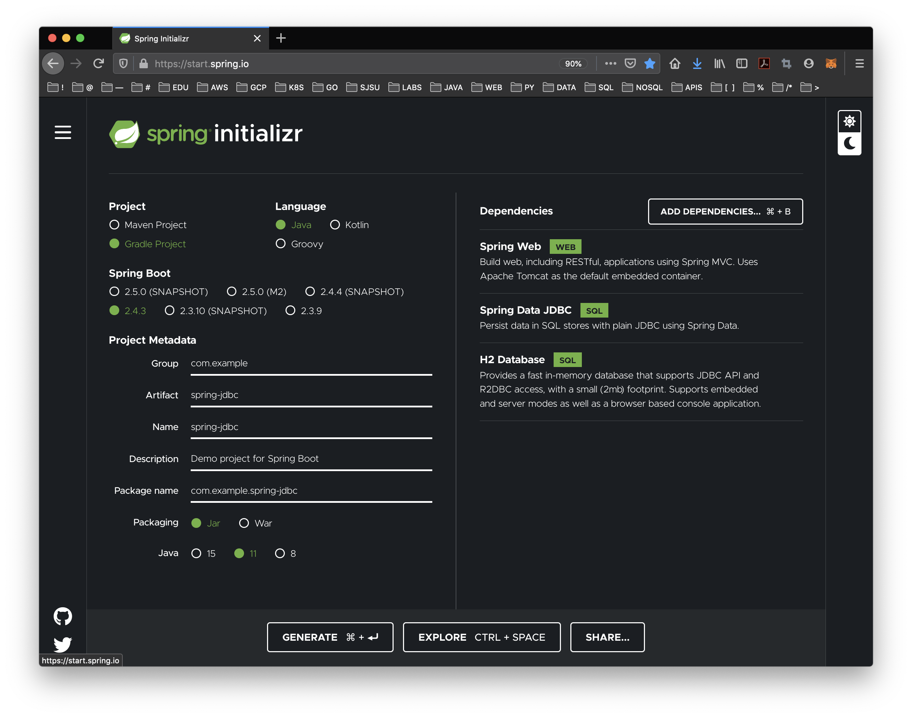
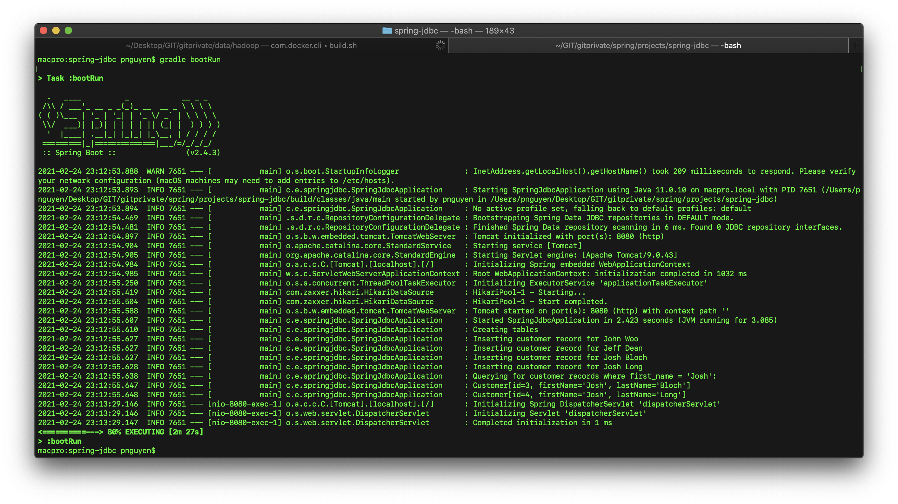
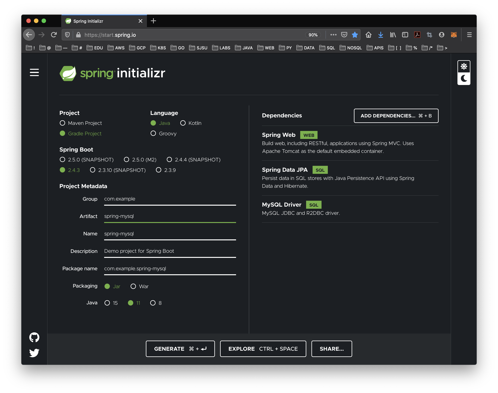

# CMPE 172 - Lab #5 - Spring Data 

* Lab Files with Starter Code: https://github.com/paulnguyen/cmpe172/tree/main/labs/lab5

In this Lab, you will be exploring Spring Data and Testing them locally on your machine.  In addition, you will be updating Spring Gumballl (to Version 3) and deploying it to Google Cloud (GKE).  

Your work should be committed on a regular basis (each day you have a change) to your assigned GitHub Private Repo in the https://github.com/nguyensjsu organization.  Your submission should include all the source code and notes on your work (including required screenshots) in README.md (GitHub Markdown).  

* In the /labs/lab5 folder, include
  * spring-gumball-v3 
  * spring-jdbc
  * spring-mysql
  * images (screenshots)
  * README.md (lab notes)
  * mongo-queries.md


# Spring JDBC

* https://spring.io/guides/gs/relational-data-access/
* https://github.com/spring-guides/gs-relational-data-access


1. Start a Spring Initializr Project

```
    Project: Gradle Project
    Language: Java Language (JDK 11)
    Spring Boot Version: 2.4.3
    Group: com.example
    Artifact: spring-jdbc
    Name: spring-jdbc
    Package Name: come.example.spring-jdbc
    Packaging: Jar
    Dependencies:
        Spring Web
        Spring LDAP
 ```



2. Create a Customer Object

* Customer.java

The simple data access logic you will work with manages the first and last names of customers. To represent this data at the application level, create a Customer class.

```
public class Customer {
  private long id;
  private String firstName, lastName;

  public Customer(long id, String firstName, String lastName) {
    this.id = id;
    this.firstName = firstName;
    this.lastName = lastName;
  }

  @Override
  public String toString() {
    return String.format(
        "Customer[id=%d, firstName='%s', lastName='%s']",
        id, firstName, lastName);
  }

  // getters & setters omitted for brevity
}
```

3. Store and Retrieve Data

Spring provides a template class called JdbcTemplate that makes it easy to work with SQL relational databases and JDBC. Most JDBC code is mired in resource acquisition, connection management, exception handling, and general error checking that is wholly unrelated to what the code is meant to achieve. The JdbcTemplate takes care of all of that for you. All you have to do is focus on the task at hand.

* SpringJdbcApplication.java

```

import org.springframework.boot.SpringApplication;
import org.springframework.boot.autoconfigure.SpringBootApplication;

import org.slf4j.Logger;
import org.slf4j.LoggerFactory;
import org.springframework.beans.factory.annotation.Autowired;
import org.springframework.boot.CommandLineRunner;
import org.springframework.boot.SpringApplication;
import org.springframework.boot.autoconfigure.SpringBootApplication;
import org.springframework.jdbc.core.JdbcTemplate;

import java.util.Arrays;
import java.util.List;
import java.util.stream.Collectors;

@SpringBootApplication
public class SpringJdbcApplication implements CommandLineRunner {

  private static final Logger log = LoggerFactory.getLogger(SpringJdbcApplication.class);

  public static void main(String args[]) {
    SpringApplication.run(SpringJdbcApplication.class, args);
  }

  @Autowired
  JdbcTemplate jdbcTemplate;

  @Override
  public void run(String... strings) throws Exception {

    log.info("Creating tables");

    jdbcTemplate.execute("DROP TABLE customers IF EXISTS");
    jdbcTemplate.execute("CREATE TABLE customers(" +
        "id SERIAL, first_name VARCHAR(255), last_name VARCHAR(255))");

    // Split up the array of whole names into an array of first/last names
    List<Object[]> splitUpNames = Arrays.asList("John Woo", "Jeff Dean", "Josh Bloch", "Josh Long").stream()
        .map(name -> name.split(" "))
        .collect(Collectors.toList());

    // Use a Java 8 stream to print out each tuple of the list
    splitUpNames.forEach(name -> log.info(String.format("Inserting customer record for %s %s", name[0], name[1])));

    // Uses JdbcTemplate's batchUpdate operation to bulk load data
    jdbcTemplate.batchUpdate("INSERT INTO customers(first_name, last_name) VALUES (?,?)", splitUpNames);

    log.info("Querying for customer records where first_name = 'Josh':");
    jdbcTemplate.query(
        "SELECT id, first_name, last_name FROM customers WHERE first_name = ?", new Object[] { "Josh" },
        (rs, rowNum) -> new Customer(rs.getLong("id"), rs.getString("first_name"), rs.getString("last_name"))
    ).forEach(customer -> log.info(customer.toString()));
  }
}
```

* Sample Output



# Spring MySQL

* https://spring.io/guides/gs/accessing-data-mysql
* https://github.com/spring-guides/gs-accessing-data-mysql


1. Start a Spring Initializr Project

```
    Project: Gradle Project
    Language: Java Language (JDK 11)
    Spring Boot Version: 2.4.3
    Group: com.example
    Artifact: spring-mysql
    Name: spring-mysql
    Package Name: come.example.spring-mysql
    Packaging: Jar
    Dependencies:
        Spring Web
        Spring Data JPA
        MySQL Driver
 ```



2. Create a MySQL Database

* Run on Docker

Note:  DB root password is cmpe172.

This connects to MySQL as root and allows access to the user from all hosts. This is not the recommended way for a production server. 

```
docker run -d --name mysql -td -p 3306:3306 -e MYSQL_ROOT_PASSWORD=cmpe172 mysql:8.0
```

* Docker command to access MySQL Container:

```
docker exec -it mysql bash
mysql --password
```

* Create Database

To create a new database, run the following commands at the mysql prompt:

```
mysql> create database db_example; -- Creates the new database
mysql> create user 'springuser'@'%' identified by 'ThePassword'; -- Creates the user
mysql> grant all on db_example.* to 'springuser'@'%'; -- Gives all privileges to the new user on the newly created database
```

3. Create the application.properties File

Spring Boot gives you defaults on all things. For example, the default database is H2. Consequently, when you want to use any other database, you must define the connection attributes in the application.properties file.

Create a resource file called src/main/resources/application.properties, as the following listing shows:

* application.properties

```
spring.jpa.hibernate.ddl-auto=update
spring.datasource.url=jdbc:mysql://${MYSQL_HOST:localhost}:3306/db_example
spring.datasource.username=springuser
spring.datasource.password=ThePassword
```

Here, spring.jpa.hibernate.ddl-auto can be none, update, create, or create-drop. See the Hibernate documentation for details.

    none: The default for MySQL. No change is made to the database structure.

    update: Hibernate changes the database according to the given entity structures.

    create: Creates the database every time but does not drop it on close.

    create-drop: Creates the database and drops it when SessionFactory closes.

You must begin with either create or update, because you do not yet have the database structure. After the first run, you can switch it to update or none, according to program requirements. Use update when you want to make some change to the database structure.

The default for H2 and other embedded databases is create-drop. For other databases, such as MySQL, the default is none.

```
It is a good security practice to, after your database is in a production state, set this to none, revoke all privileges from the MySQL user connected to the Spring application, and give the MySQL user only SELECT, UPDATE, INSERT, and DELETE.
```

4. Create the @Entity Model

Hibernate automatically translates the entity into a table.

* User.java

```
import javax.persistence.Entity;
import javax.persistence.GeneratedValue;
import javax.persistence.GenerationType;
import javax.persistence.Id;

@Entity // This tells Hibernate to make a table out of this class
public class User {
  @Id
  @GeneratedValue(strategy=GenerationType.AUTO)
  private Integer id;

  private String name;

  private String email;

  public Integer getId() {
    return id;
  }

  public void setId(Integer id) {
    this.id = id;
  }

  public String getName() {
    return name;
  }

  public void setName(String name) {
    this.name = name;
  }

  public String getEmail() {
    return email;
  }

  public void setEmail(String email) {
    this.email = email;
  }
}
```


5. Create the Repository

* UserRepository.java

You need to create the repository that holds user records.  Spring automatically implements this repository interface in a bean that has the same name (with a change in the case — it is called userRepository).

```
import org.springframework.data.repository.CrudRepository;

import com.example.accessingdatamysql.User;

// This will be AUTO IMPLEMENTED by Spring into a Bean called userRepository
// CRUD refers Create, Read, Update, Delete

public interface UserRepository extends CrudRepository<User, Integer> {

}
```

6. Create a Controller

* MainController.java

```
import org.springframework.beans.factory.annotation.Autowired;
import org.springframework.stereotype.Controller;
import org.springframework.web.bind.annotation.GetMapping;
import org.springframework.web.bind.annotation.PostMapping;
import org.springframework.web.bind.annotation.RequestMapping;
import org.springframework.web.bind.annotation.RequestParam;
import org.springframework.web.bind.annotation.ResponseBody;

@Controller // This means that this class is a Controller
@RequestMapping(path="/demo") // This means URL's start with /demo (after Application path)
public class MainController {
  @Autowired // This means to get the bean called userRepository
         // Which is auto-generated by Spring, we will use it to handle the data
  private UserRepository userRepository;

  @PostMapping(path="/add") // Map ONLY POST Requests
  public @ResponseBody String addNewUser (@RequestParam String name
      , @RequestParam String email) {
    // @ResponseBody means the returned String is the response, not a view name
    // @RequestParam means it is a parameter from the GET or POST request

    User n = new User();
    n.setName(name);
    n.setEmail(email);
    userRepository.save(n);
    return "Saved";
  }

  @GetMapping(path="/all")
  public @ResponseBody Iterable<User> getAllUsers() {
    // This returns a JSON or XML with the users
    return userRepository.findAll();
  }
}
```

7. Test the Application

Now that the application is running, you can test it by using curl or some similar tool. You have two HTTP endpoints that you can test:

GET localhost:8080/demo/all: Gets all data. 
POST localhost:8080/demo/add: Adds one user to the data.

* Add User:  

```
curl localhost:8080/demo/add -d name=First -d email=someemail@someemailprovider.com
```

* Show All Users:

```
curl 'localhost:8080/demo/all'
```

8. Make Some Security Changes

When you are on a production environment, you may be exposed to SQL injection attacks. A hacker may inject DROP TABLE or any other destructive SQL commands. So, as a security practice, you should make some changes to your database before you expose the application to your users.

The following command revokes all the privileges from the user associated with the Spring application:

```
mysql> revoke all on db_example.* from 'springuser'@'%';
```

Now the Spring application cannot do anything in the database.

The application must have some privileges, so use the following command to grant the minimum privileges the application needs:

```
mysql> grant select, insert, delete, update on db_example.* to 'springuser'@'%';
```

Removing all privileges and granting some privileges gives your Spring application the privileges necessary to make changes to only the data of the database and not the structure (schema).

When you want to make changes to the database:

    Regrant permissions.

    Change the spring.jpa.hibernate.ddl-auto to update.

    Re-run your applications.

Then repeat the two commands shown here to make your application safe for production use again. Better still, use a dedicated migration tool, such as Flyway or Liquibase.


# Setting Up MySQL and MongoDB

Create a "cmpe172" database in MySQL and Mongo.  Use the provided Docker commands to launch a local version of MySQL and MongoDB.  You may use commad line query interfaces for this part of the lab or use a GUI like MySQL Workbench and Robo 3T (for MongoDB).

* MySQL

Create DB Schema (DDL) and Load BIOS data using:

```
bios-schema.sql
bios-data.sql
```

* MongoDB

Create DB Schema (DDL) and Load BIOS data using:

```
bios.js
```


# SQL vs MongoDB

Provide the MongoDB equivalent Queries for the following MySQL SQL Queries using the BIOS data.
Save your solution to GitHub in the file:  mongo-queries.md.


## 1 - Count of Records/Documents

```
select count(*) from person
```
  
## 2 - Find Bios with Birth Date before 1950

```
select first_name, last_name, birth_date 
from person
where birth_date < date('1950-01-01')
```
  
## 3 - Get a Unique Listing of all the Awards (in DB/Collection) granted

```
select distinct(a.award_name)
from person_awards pa, awards a
where pa.award_id = a.award_id
```

## 4 - Get a Sorted Listing of all the First Names (ascending order)
  
```
select first_name
from person
order by 1
```
  
## 5 - Get a Sorted Listing of all the First Names (descending order)

```
select first_name
from person
order by 1 desc
```

## 6 - Count the number of BIOS that don't yet have an award  

```
select count(*) from person p
where not exists 
    (select 1 from person_awards 
     where person_id = p.person_id)
```

## 7 - Display the System ID (Primary Key) for the BIO in Query #6

```
select p.person_id from person p
where not exists 
  (select 1 from person_awards 
   where person_id = p.person_id)
```

## 8. Display names (first and last) along with awards and contributions from BIOS with 1 Contribution AND 2 Awards

```
select p.first_name, p.last_name
from person p
where (select count(*) from contribs c where c.person_id = p.person_id) = 1
and (select count(*) from person_awards pa where pa.person_id = p.person_id) = 2
```

## 9. Display names (first and last) along with awards and contributions from BIOS with 1 Contributions OR 2 Awards

```
select p.first_name, p.last_name
from person p
where (select count(*) from contribs c where c.person_id = p.person_id) = 1
or (select count(*) from person_awards pa where pa.person_id = p.person_id) = 2
```

## 10 - List all the Awards for a BIO

```
select p.first_name, p.last_name, a.award_name
from awards a, person_awards pa, person p
where a.award_id = pa.award_id
and p.person_id = pa.person_id
and p.person_id = 1
```


# Spring Gumball (Version 3)

Create a "Version 3" of your Spring Gumball (based on your implementation of Version 2 from the last lab).  In Version 3, add "Spring JPA with MySQL" and map Spring Gumball Domain Object to MySQL.

Make the "serialNumber" unique in the Database and pre-configure your Spring Java code to look for a specific Serial Number in the DB based on a Static String of Configuration.

```
class GumballModel {

    private String modelNumber ;
    private String serialNumber ;
    private Integer countGumballs ;
    
}
```

Change the Gumball Controller to update the Gumball Inventory in the DB and also update the HTML view to display the Model Number and Serial Number fetched from the DB.


# References

## MySQL:

* Spring Data JDBC:  https://spring.io/projects/spring-data-jdbc
* Spring Data JPA:  https://spring.io/projects/spring-data-jpa
* MySQL Reference (version 8.0):  https://dev.mysql.com/doc/refman/8.0/en/
* MySQL Docker Image:  https://hub.docker.com/_/mysql
* Connecting from GKE:  https://cloud.google.com/sql/docs/mysql/connect-kubernetes-engine
* MySQL Workbench:  https://www.mysql.com/products/workbench/
  - Get version 8.0.22 from Archives (on Mac)
  - https://downloads.mysql.com/archives/workbench/
* Astah DB Reverse Plug-Inb:  https://astah.net/product-plugins/db-reverse-plug-in/
* DB Schema (Free Edition):  https://dbschema.com/editions.html
* Google Cloud SQL:  https://cloud.google.com/sql
  - Supported Versions:  5.6, 5.7 and 8.0

## Mongo

* Spring Data MongoDB:  https://spring.io/projects/spring-data-mongodb
* MongoDB Reference (version 4.4):  https://docs.mongodb.com/manual/
  - CRUD Concepts:  https://docs.mongodb.com/manual/core/crud/
  - CRUD Operations:  https://docs.mongodb.com/manual/crud/
  - BIOS Example Collection:  https://docs.mongodb.com/manual/reference/bios-example-collection/
  - SQL to Mongo Mappings:  https://docs.mongodb.com/manual/reference/sql-comparison/
  - Aggregation Pipeline:  https://docs.mongodb.com/manual/aggregation/
* MongoDB Docker Image:  https://hub.docker.com/_/mongo
* Robo 3T for Mongo:  https://robomongo.org/
* MongoDB on Google Cloud:  https://www.mongodb.com/cloud/atlas/mongodb-google-cloud


## Redis

* Spring Data Redis:  https://spring.io/projects/spring-data-redis
* Redis Documentation:  https://redis.io/documentation
* Redis Commands Reference:  https://redis.io/commands
* Redis Command Line Interface:  https://redis.io/topics/rediscli
* Redis Tutorial:  https://www.tutorialspoint.com/redis/index.htm
* Google Memorystore:  https://cloud.google.com/memorystore
  - Supported Versions:  3.2, 4.0, 5.0


