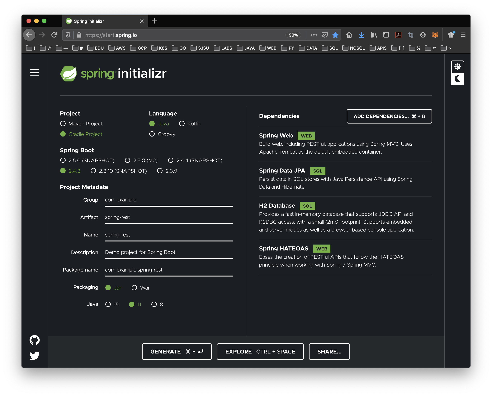
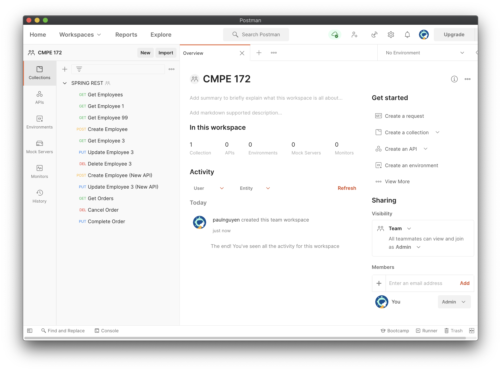
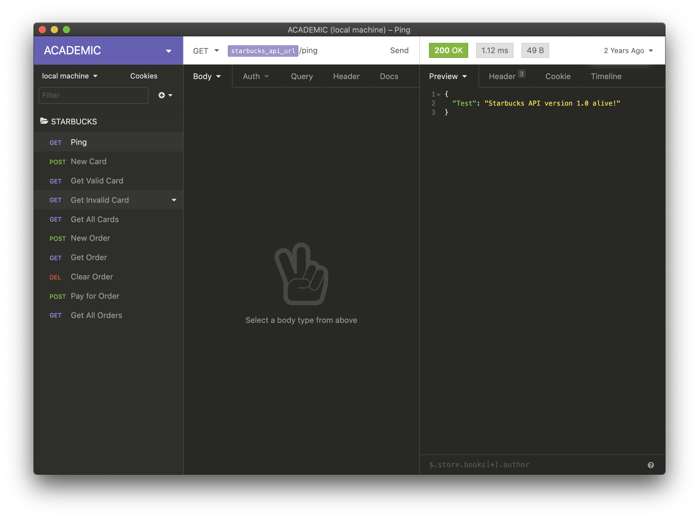
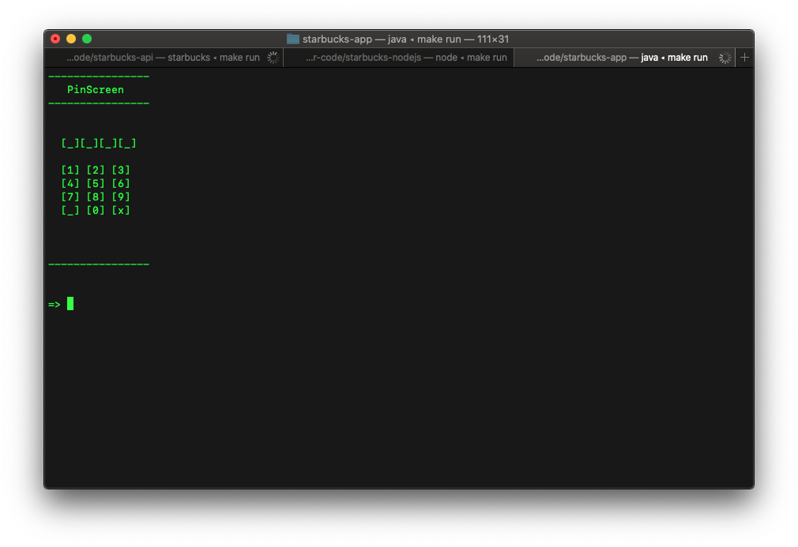
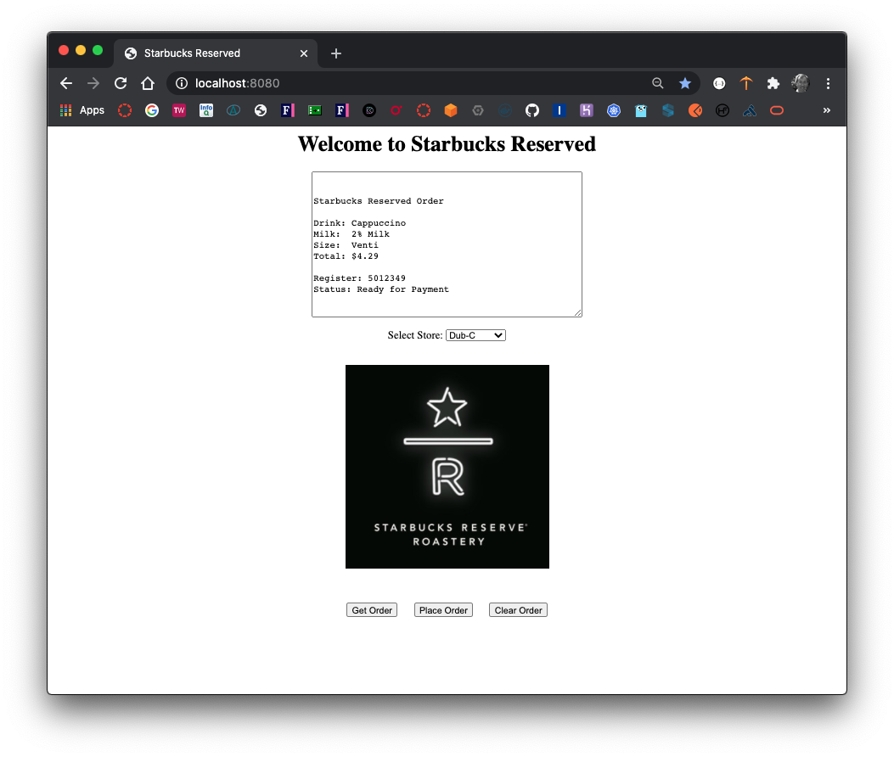
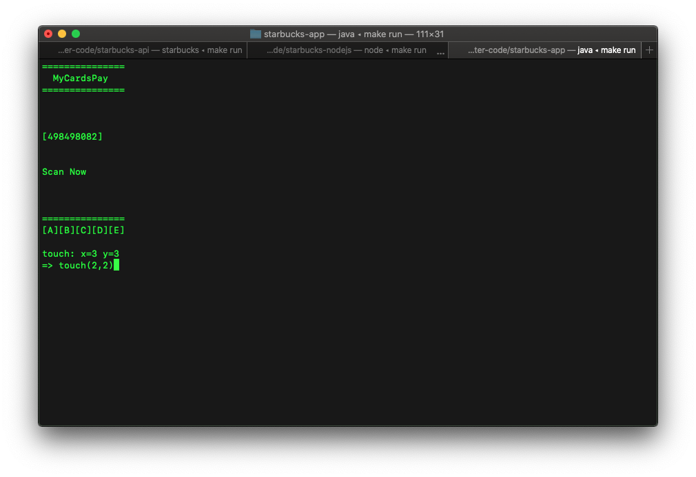
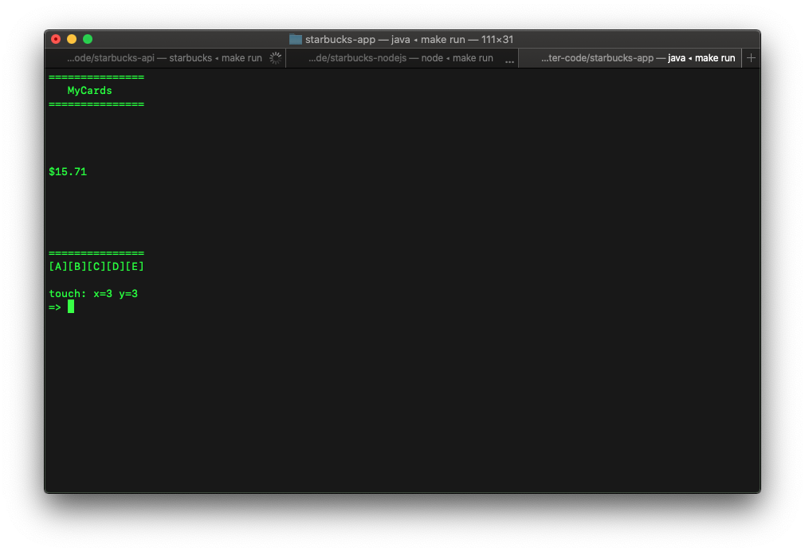
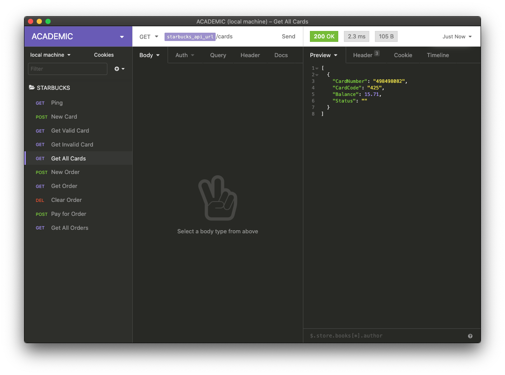
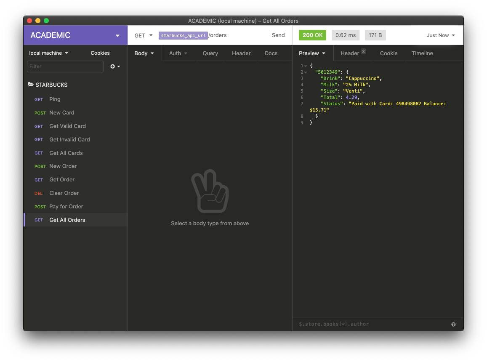

# LAB #6 NOTES

* Lab Files with Starter Code: https://github.com/paulnguyen/cmpe172/tree/main/labs/lab6

In this Lab, you will be exploring Spring REST APIs and porting a Starbucks REST API written in Go to Java Spring.  In addition, you will be deploying your Starbucks API to Google Cloud (GKE).  

Your work should be committed on a regular basis (each day you have a change) to your assigned GitHub Private Repo in the https://github.com/nguyensjsu organization.  Your submission should include all the source code and notes on your work (including required screenshots) in README.md (GitHub Markdown).  

* In the /labs/lab6 folder, include
  * spring-rest
  * spring-starbucks-api
  * insomnia-project.json
  * postman-collection.json
  * images (screenshots)
  * README.md (lab notes)


# Building REST services with Spring

* https://spring.io/guides/tutorials/rest
* https://docs.spring.io/spring-hateoas/docs/1.2.4/api
* https://github.com/spring-projects/spring-hateoas-examples

Follow the Tutorial from Spring Guides at https://spring.io/guides/tutorials/rest/.  As you build the REST API in the example, test the API using CURL as well as with an API Development Tool -- Postman (https://www.postman.com/).  

All work for this Turtorial will be done locally.  There is no requirement for deployment to Google Cloud.

## Spring Initializr

```
    Project: Gradle Project
    Language: Java Language (JDK 11)
    Spring Boot Version: 2.4.3
    Group: com.example
    Artifact: spring-rest
    Name: spring-rest
    Package Name: come.example.spring-rest
    Packaging: Jar
    Dependencies:
        Spring Web
        Spring Data JPA
        Spring HATEOAS
        H2 Database
 ```




Take notes on your work to record your progress and any issues you encounter and how you resolved them.

HINTS:

* If you run into any compilation errors, here are the Imports you will need in the Controllers.
* For other classes, not all of the imports below are needed.  Refer to appropriate Java Doc.

```
import org.springframework.web.bind.annotation.DeleteMapping;
import org.springframework.web.bind.annotation.GetMapping;
import org.springframework.web.bind.annotation.PathVariable;
import org.springframework.web.bind.annotation.PostMapping;
import org.springframework.web.bind.annotation.PutMapping;
import org.springframework.web.bind.annotation.RequestBody;
import org.springframework.web.bind.annotation.RestController;
import org.springframework.http.ResponseEntity;
import org.springframework.http.HttpHeaders;
import org.springframework.http.HttpStatus;

import static org.springframework.hateoas.server.mvc.WebMvcLinkBuilder.*;
import org.springframework.hateoas.IanaLinkRelations;
import org.springframework.hateoas.CollectionModel;
import org.springframework.hateoas.EntityModel;
import org.springframework.hateoas.Links;
import org.springframework.hateoas.MediaTypes;
import org.springframework.hateoas.mediatype.problem.Problem;

import java.net.URI;
import java.net.URISyntaxException;
import java.util.List;
import java.util.stream.Collectors;
import java.util.stream.StreamSupport;
```

Test your REST API using the Postman Collection provided.




# Starbucks End-to-End Example


## Porting the REST API to Spring

Build and Run the provided Starbucks API in Go.  See Demo in class on how to setup, build and run a Go Application.  Then test the Starbucks API, use the provided Insomnia Project.  Note:  Your implementation just needs to be a Level-2 (CRUD) Rest API -- that is, Hypermedia (Level-2 / HATEOAS).



The API Specification is as follows.  Port this API into Spring REST and MySQL JPA and commit your work in a folder named:  spring-starbucks-api.  Test your API using Insomnia or Postman (modify the Insomnia/Postman as needed).

The Starbucks API Specification is as follows:

```
GET 	/ping
		Ping Health Check.

GET 	/cards 
		Get a list of Starbucks Cards (along with balances).

		[
		  {
		    "CardNumber": "498498082",
		    "CardCode": "425",
		    "Balance": 20.00
		  },
		  {
		    "CardNumber": "627131848",
		    "CardCode": "547",
		    "Balance": 20.00
		  }
		]		

POST 	/cards
		Create a new Starbucks Card.

		{
		  "CardNumber": "627131848",
		  "CardCode": "547",
		  "Balance": 20.00
		}

GET 	/cards/{num}
		Get the details of a specific Starbucks Card.

		{
		  "CardNumber": "627131848",
		  "CardCode": "547",
		  "Balance": 20.00
		}		

GET 	/card/{num}/{code}
		Validate Card 

		{
		  "CardNumber": "627131848",
		  "CardCode": "547",
		  "Balance": 20.00
		}	

POST    /order/register/{regid}
        Create a new order. Set order as "active" for register.

	    {
	      "Drink": "Latte",
	      "Milk":  "Whole",
	      "Size":  "Grande"
	    }         

GET     /order/register/{regid}
        Request the current state of the "active" Order.

DELETE  /order/register/{regid}
        Clear the "active" Order.

POST    /order/register/{regid}/pay/{cardnum}
        Process payment for the "active" Order. 

GET     /orders
        Get a list of all active orders (for all registers)

DELETE 	/cards
		Delete all Cards (Use for Unit Testing Teardown)

DELETE 	/orders
		Delete all Orders (Use for Unit Testing Teardown)
```

## Explore the Sample Node.js and Java Mobile App Simulator (Optional)

This section is not required, but is a "preview" to the next Lab (Lab #6).  There are REST Client Sample Apps in starbucks-app and starbucks-nodejs.  Run these Apps against the Starbucks Go API and explore how they work.

In future Labs, you will have to modify these Apps to work with your Spring Starbucks API.


### Example Workflow

1. Starbucks App (Mobile App Simulator)

* Requires Gradle 4.9 and Java JDK 8
* Launch and Login with PIN: 1234 
* See starbuccks-app.xlsx 



2. Placing an Order on the Starbucks Cash Register (Node.js App)

* Note: To run Node.js App, use Node.js version: v8.15.0



3. Run Starbucks API (Compile and run in Go)

* Note: To run Go API App, use GO version: 1.11 (code doesn't support modules yet)

* Build and Run API locally (see Makefile Rules)

```
	> go version
	go version go1.11.1 darwin/amd64
	> set GOPATH to working dir
	export GOPATH=$(pwd);export PATH=$PATH:$GOPATH/bin;echo $GOPATH
	> go build starbucks
	> ./starbucks
```

* Alternatively, run via Docker Image:  paulnguyen/starbucks-api:v1.0

```
	docker run --name starbucks -p 3000:3000 -td paulnguyen/starbucks-api:v1.0
```

4. Paying on the Starbucks App



5. See Balance on Starbucks Card after Payment



6. Check Starbucks Cash Register for Successful Payment (Node.js App)


7. Sample REST API Calls from Insomnia (List Cards)



8. Sample REST API Calls from Insomnia (List Orders)




# References


## Building a RESTful Web Service: 

* https://spring.io/guides/gs/rest-service
* https://github.com/spring-guides/gs-rest-service

## Building a Hypermedia-Driven RESTful Web Service

* https://spring.io/guides/gs/rest-hateoas
* https://github.com/spring-guides/gs-rest-hateoas

## Building REST services with Spring

* https://spring.io/guides/tutorials/rest/
* https://docs.spring.io/spring-hateoas/docs/1.2.4/api/
* https://github.com/spring-projects/spring-hateoas-examples


