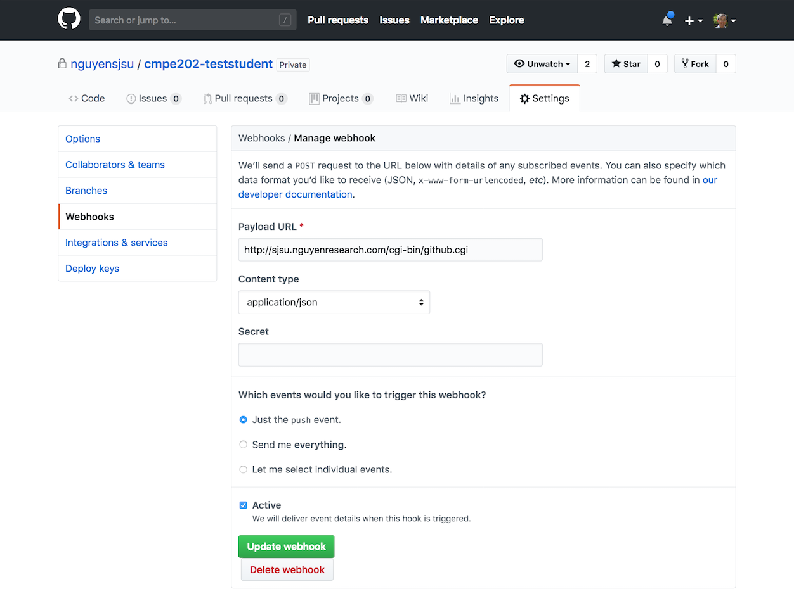

# Starbucks Mobile App (Text UI) Project

## Submission for Grader

To get your code graded, commit your stable changes to the *master* branch and then request the a grader test at the following:

* http://sjsu.nguyenresearch.com/cgi-bin/grader.cgi

Type in your *repo* name and click "submit".  I.E. cmpe202-teststudent.  It may take up to 5-10 minutes as the Grader picks up your request.  You can check your results at the following location.

* http://sjsu.nguyenresearch.com/grader

## Slack Messages from Grader

The Grader will post a message once your test results are ready.  The message will be in the *#starbucks* channel.  An example message looks like:

<pre>
Starbucks APP [8:50 PM]
Tests: 72% - Comments:  0 - Bugs: 8 - Smells: 22 - http://sjsu.nguyenresearch.com/grader/cmpe202-teststudent
</pre>

## Grader Test Results

Grader results are posted in the following files:

* tests.html
* bugs.html
* codesmells.txt

## Running Local Tests

If you hve Gradle 4.9 installed locally, you can run the following Makfile rules to get local results.  Please note that the JUnit tests will be only the ones locally available and not the full set of tests the Grader uses.

<pre>
test:
    gradle test

spotbugs:
    gradle spotbugsMain

codesmells:
    gradle smartsmells
</pre>

## Setting Up a GitHub Webhook

You can also configure your GitHub Repo to automatically submit a Grader request upon a commit to your *master* branch.  Set this up as follows:

* Webhook URL:  http://sjsu.nguyenresearch.com/cgi-bin/github.cgi
* Content Type: application/json
* Event Trigger: push 

