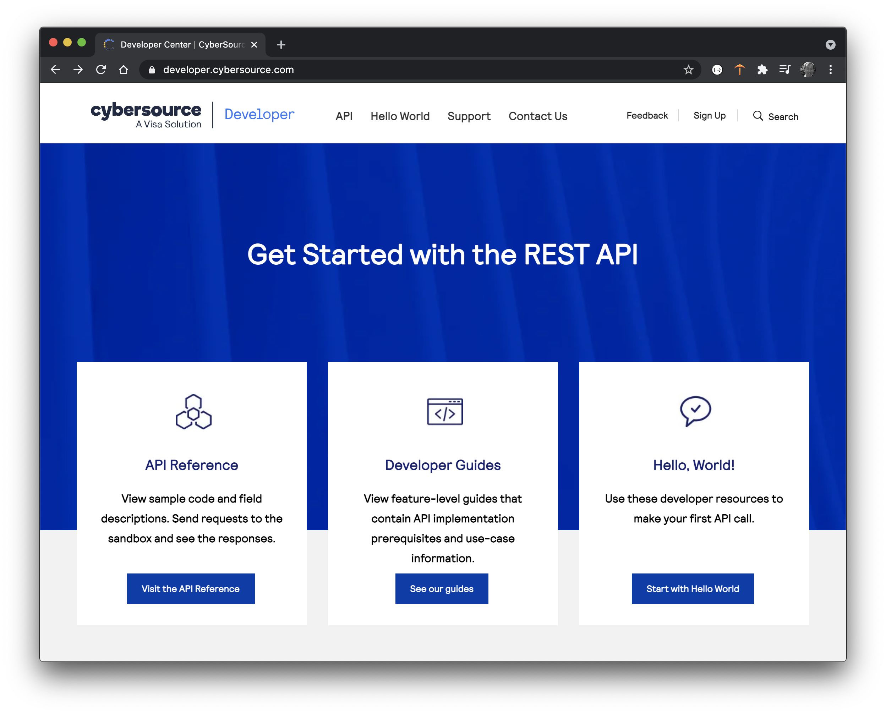
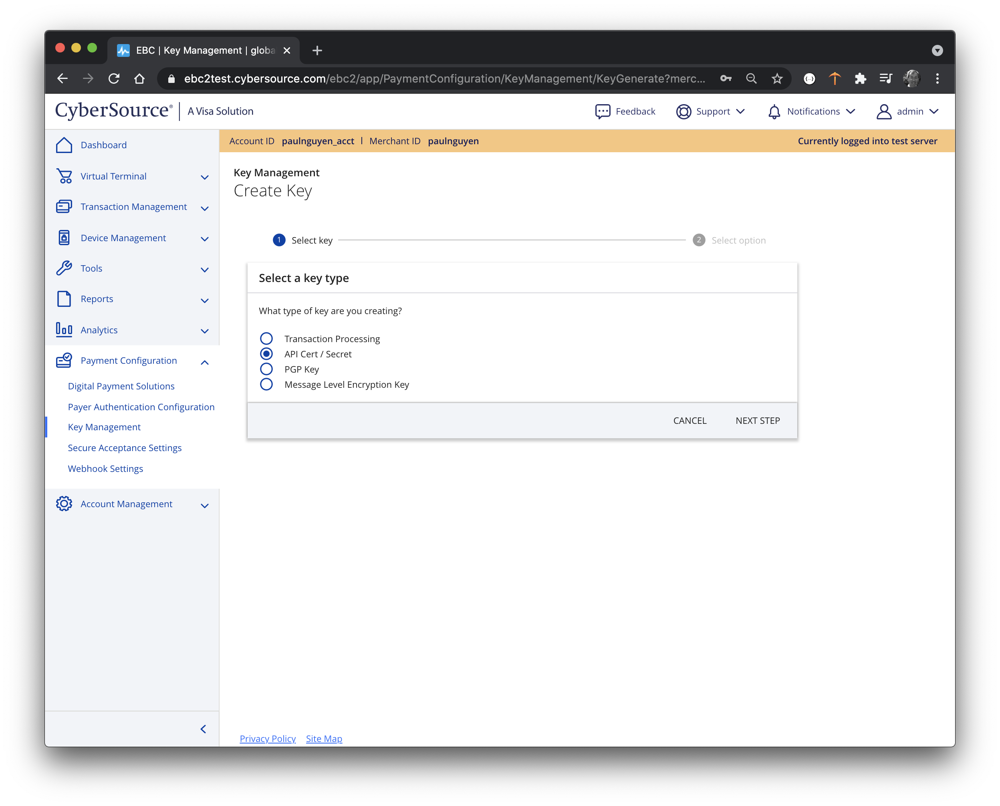
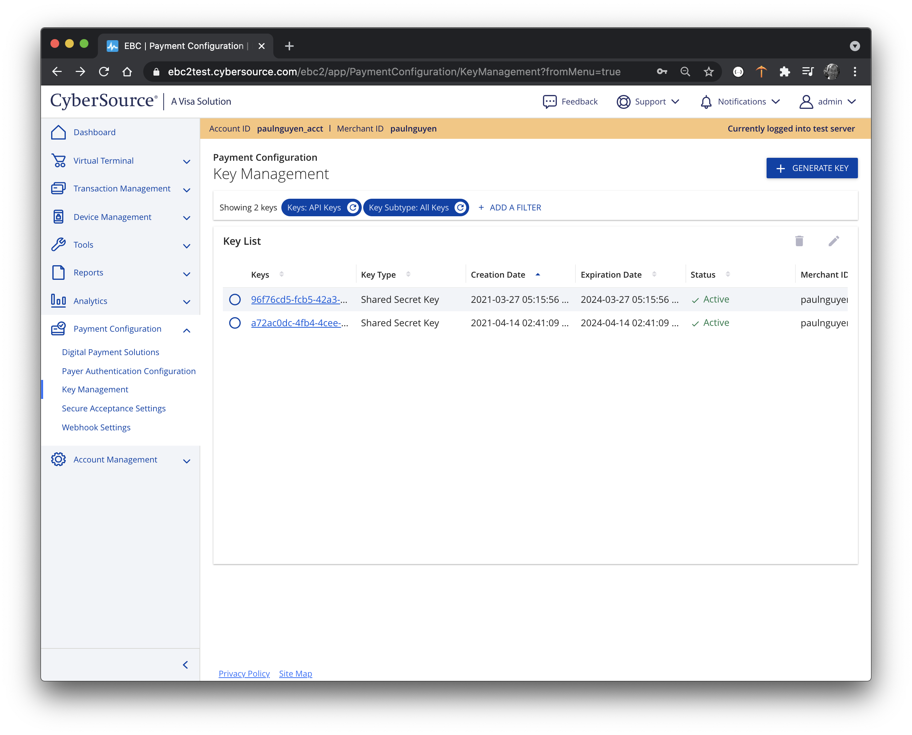
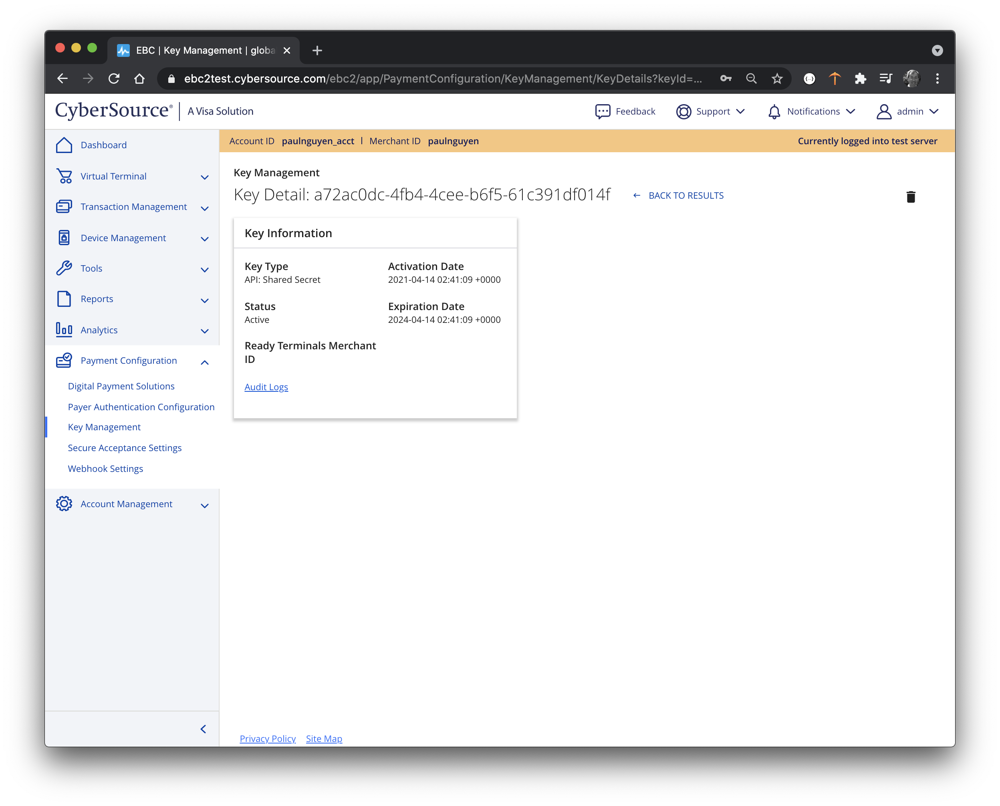
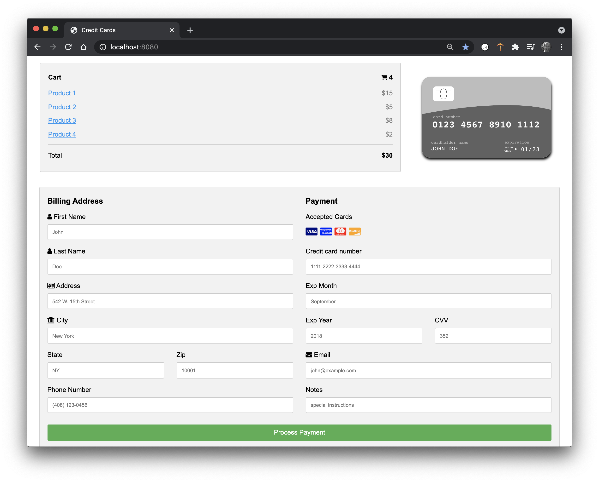
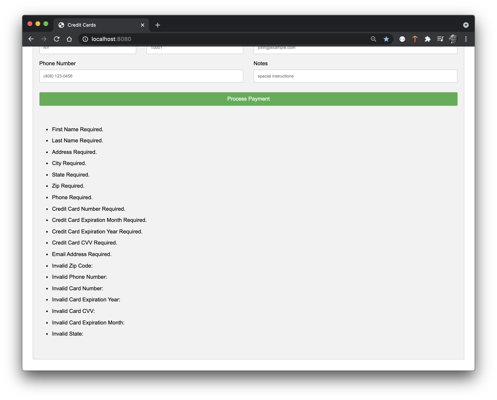
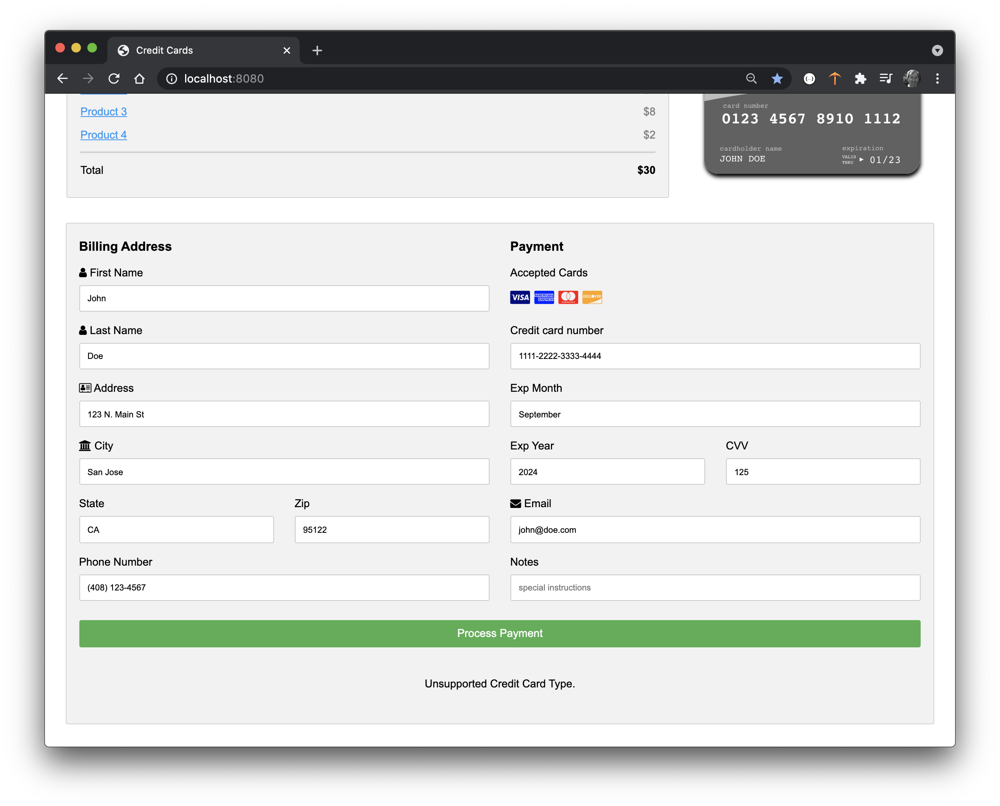

# CMPE 172 - Lab #7 - Spring Payments

* Lab Files with Starter Code: https://github.com/paulnguyen/cmpe172/tree/main/labs/lab7

In this Lab, you will given some "starter code" for a Spring Payments Page and adding Server Side Form Validation and integration with the CyberSource Payments Gateway.  The starter code will also include an Java API Proxy with abstracts all the HTTP REST API and Security functionality for you.  This API will need to be integrated with the Spring Payments Project.

Your work should be committed on a regular basis (each day you have a change) to your assigned GitHub Private Repo in the https://github.com/nguyensjsu organization.  Your submission should include all the source code and notes on your work (including required screenshots) in README.md (GitHub Markdown).  

* In the /labs/lab7 folder, include
  * spring-cybersource
  * spring-payments
  * images (screenshots)
  * README.md (lab notes)

## CyberSource Account

Sign-up for a Free Developer Sandbox at Cybersource:  

* https://developer.cybersource.com 

Click on "Start with Hello, World!", then "Create Sandbox Account".
For Merchant ID, pick something unique (i.e. your GitHub User ID).
For Company Name, Address and Email, use San Jose State's and your SJSU.edu email.

Once you have created your Account, the Merchant Portal for your test account will be at:

* https://ebc2test.cybersource.com/ebc2/

Also note these addtional helpful resources to Get Started:

* https://www.youtube.com/watch?v=NXU1XKT3m90
* https://developer.cybersource.com/hello-world/testing-guide.html
* https://developer.cybersource.com/hello-world/common-setup-questions.html

Log into your Merchant Portal and Generate a Merchant Key as follows:

1. Click on "Payment Configuration"
2. Select "Key Management"
3. Click Generate Key
4. Select Shared Secret Key

5. Copy/Save or Download Key (Key Shared Secret)

6. Go back to "Key Management"
7. Search for "API Keys", Subtype "All Keys"

8. Note the Key Details, this is your Key's Serial Number (aka Key ID).

For Example:

* Key Serial Number:  *a72ac0dc-4fb4-4cee-b6f5-61c391df014f*
* Key Shared Secret:  *03aAMywxmjQ9o3YW9jVWdtmLm9Z6DTLz8nOob/J8QuU=*

## Payment Page

Make modifications to the starter code (as necessary and in any direction you chose) to implement the following requirements:

### Form Validation Requirements

* Add an in-memory H2 database and use Spring JPA Repositories to persist the Payment information

* Add Form validation making all Form Fields "Required" except for the Notes field.

* Add additional Form Validations as follows:
	* State should be one of the two letter abbreviations for the 50 U.S. States
	* Zip Code should be 5 digits.
	* Phone Number should have the format: (###) ###-####.  
		* For example: (408) 123-4567.
	* Credit Card Number should have the format:  ####-####-####-####.  
		* For example:  4444-4444-4444-4444.
	* Hints:
		* https://www.vogella.com/tutorials/JavaRegularExpressions/article.html
		* https://regex101.com/ 

	* Credit Card Expiration Month should be the full month spelled out.
		* For example:  September
		* Note: CyberSource expects two digit months, so this would be *09* in API call.
	* Credit Card Expiration Year should be 4 digits.
	* Credit Card CVV should be 3 digits.
	* Credit Cart Types supported should be one of hte three digits:
		* 001 - Visa
		* 002 - Mastercard, Eurocard1: European regional brand of Mastercard.
		* 003 - American Express
		* 004 - Discover
		* 005 - Diners Club
	* This can be determined based on the first digit of the credit card number as follows:  American Express(3), Visa (4), Mastercard (5) or Discover (6).
	*  See:
		*  https://wallethub.com/edu/cc/what-is-a-credit-card-number/44066
		*  https://en.wikipedia.org/wiki/Payment_card_number     

### Form Validation Errors
            
If Form validation fails, show "Form Validation Errors for Each Field" at the bottom of the page and do not save the Form data to Database.

If Form validation succeeds, save the Form Data to the Database and show a message "Thank You for Your Payment!".

Note:  Form Validation can be all done on the Server Side (i.e. in the Web Controller).  Optional to do this in the Browser via CSS and/or JavaScript.

### Some Example Payment Page Output

## References

### CyberSource Payment Gateway

* https://ebc2test.cybersource.com/ebc2/
* https://developer.cybersource.com 
* https://developer.cybersource.com/hello-world.html
* https://www.cybersource.com/en-us/solutions/payment-acceptance.html
* https://developer.cybersource.com/hello-world/testing-guide.html
* https://developer.cybersource.com/hello-world/common-setup-questions.html

### ThymeLeaf & Lombok

* https://www.thymeleaf.org/doc/tutorials/3.0/thymeleafspring.html
* https://www.thymeleaf.org/doc/tutorials/3.0/usingthymeleaf.html#iteration
* https://projectlombok.org/
* https://projectlombok.org/features/Data
* https://projectlombok.org/features/GetterSetter

### Java JSON using Jackson

* https://www.baeldung.com/jackson
* https://www.baeldung.com/jackson-object-mapper-tutorial
* http://tutorials.jenkov.com/java-json/jackson-objectmapper.html

